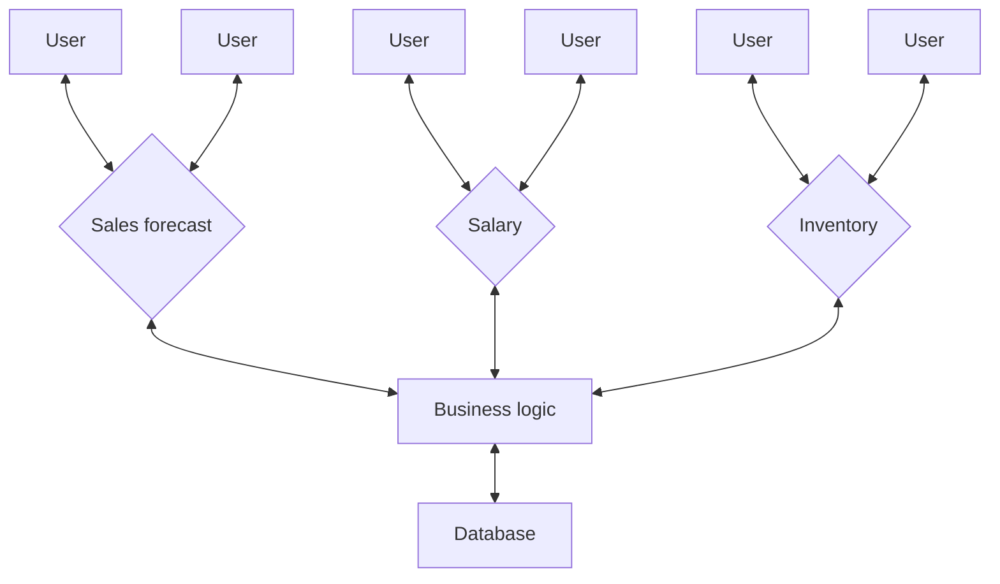
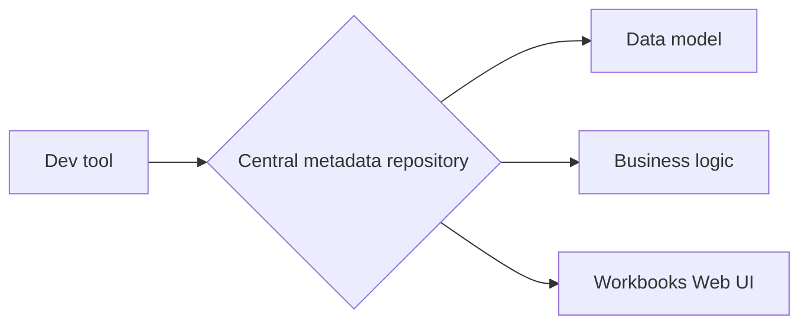
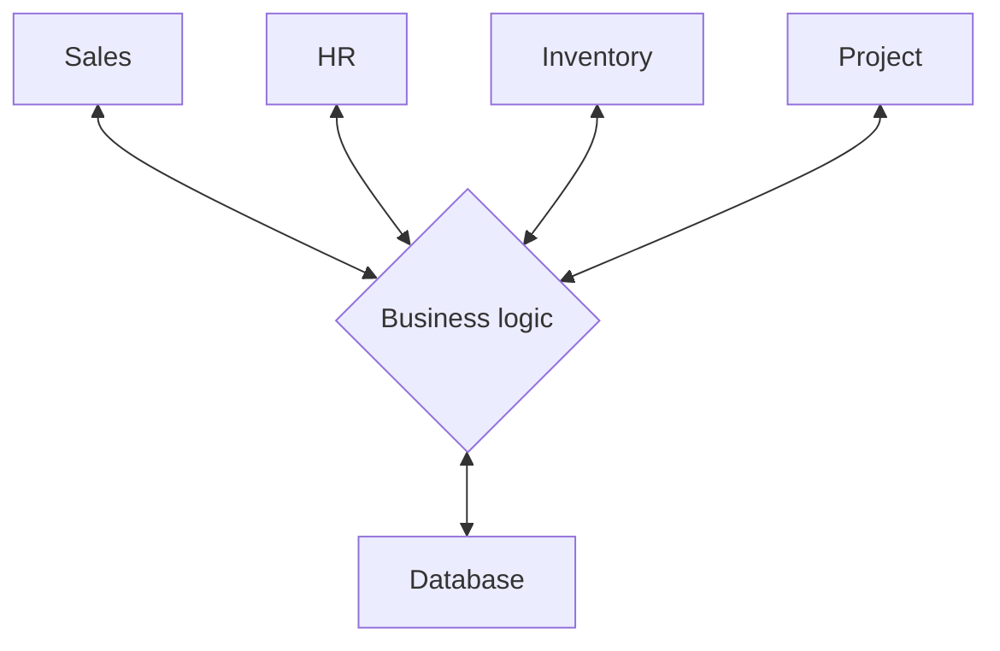

# Convert spreadsheets to Profitbase Workbooks

Profitbase Workbooks are robust and flexible business web apps, storing data in a central database.
If you’re looking to overcome the limitations and challenges of spreadsheets, here are some compelling reasons to switch to Profitbase Workbooks:  
<br/>   

#### 1. Enable distributed input with multiple contributors
Collecting input from multiple users using spreadsheets like Excel or Google Sheets usually involves sharing copies via email or file shares. Once users submit their input, you must manually collect, consolidate, and reconcile the data — a process that becomes increasingly error-prone and time-consuming as the number of users grows.

With Profitbase Workbooks, you simply share a link to a browser-based app. Built-in access controls ensure users see only the data and screens they are authorized to access, such as information specific to their department.  

Reports, filters, dropdown options, data grids, formulas, validation rules and more is loaded from the common data model. This guides users through the input process, ensuring compliance with business rules.

When users saves their work, the data is stored back to the central database through the common data model, eliminating the need to do manual collection, consolidation and reconciliation of data. 



<br/>
<br/>

#### 2. Apply security and access control
When users open a Profitbase Workbook, the built-in access control system ensures they only see the screens and data they are authorized to access. If someone unintentionally receives a link or has their access revoked, they will be automatically blocked from viewing the Workbook.

Access can be managed by power users or administrators through the admin portal, allowing permissions to be granted to individuals or groups. While the access control system is highly flexible, it is most commonly configured based on roles or affiliations, such as a user’s department or project membership.

<br/>

#### 3. Versioning and revisions
"Versions and revisions" can mean different things: 
1) **Versions and revisions of data**, for example budget versions where you have to do multiple iterations to get to the goal.
2) **Versions and revisions of data models and business logic** for existing data. For example, you need to modify the data model or add more  calculations.

**Versions and revisions of data**  
To learn about versions and revisions of data, please read the topic about [Work Processes](../../invision/docs/workprocess/index.md).

**Versions and revisions of data models and business logic**  
Profitbase Workbooks are web apps that automatically update whenever their configuration is changed. Since the configuration is stored in a central repository, updates to reports, client-side formulas, or forms are instantly reflected for all users. Similarly, changes to the data model, calculations, or dataflows take effect immediately across the entire system, thanks to its cloud-based architecture.

Unlike spreadsheets, which typically embed both data and business logic within individual files, Profitbase Workbooks eliminate the need to share new copies or links after making updates. Once changes are applied, the system updates automatically — no further action required.



<br/>
<br/>

#### 4. Automate collection, consolidation, and reconciliation of data
Profitbase Workbooks share a common data model and store all information in a central database. This common data model consolidates user input into a single repository, ensuring data integrity and consistent formats throughout the system.

Common issues associated with spreadsheets—such as inconsistent data structures, varying units or measures, duplicate entries, improper use of IDs (e.g., customer or order IDs), data format discrepancies, and incorrect formulas — are eliminated with Profitbase Workbooks. The common data model serves as the single source of truth for user input, reports, dropdowns, and filters, enforcing adherence to business rules.

Sitting between the user interface and the data model is the business logic middleware. This layer is responsible for transforming, validating, and processing data between the format presented to users and the format stored in the database.  



<br/>
<br/>

#### 5. Handle large and complex models
**Data size**  
Spreadsheets like Excel and Google Sheets have limitations on both data size (rows and columns) and complexity (formulas). Currently, both Excel and Google Sheets have practical limits of around 1 million rows. However, financial models for even small to mid-sized companies often require handling 10–100 million rows, far exceeding these constraints.

Profitbase Workbooks does not have an upper limit to how large models can be, because cloud-based databases and calculations are leveraged (You can also run Profitbase on-prem). When users make changes and save their work, only the portion of the model affected by the edits are reprocessed in the cloud. This ensures that even with large models exceeding 100 million rows, updates are applied almost instantly - usually in less than a second.

**Complexity**  
Business logic in large spreadsheets is often difficult to understand because it relies on a tangled web of formulas and cell references with meaningless names. You quickly loose track when navigating between cells and sheets to piece together how everything works. Also, the lack of capabilities to document and test formulas or parts of the model in isolation, makes building and maintaing complex spreadsheets hard.

In Profitbase Workbooks, business logic is separated from data rendering, with logic defined in code and data displayed in the UI. While this is conceptually similar to using VBA in Excel for calculations, it is fundamentally different because the logic operates on actual _data_ rather than cell or sheet _addresses_. This approach allows you to read the business logic sequentially—top to bottom, left to right—without constant context switching. Moreover, because the logic is expressed in code, it uses meaningful names instead of cell references, making calculations easier to read, understand, and maintain. As the example below shows, you can also include comments directly with the code, making it easy to document what it does.

##### Example

Profitbase Workbook formula written in C# or JavaScript. Notice the inclusion of comments, explaining what the formula does:  
```csharp
// Calculate the sales amount including VAT
Model.SalesAmount = Input.Amount + Input.Amount * Parameters.VAT;
```

Equivalent Excel formula. What F3 and Parameters!B2 refers to is not immediately obivious:
```excel
=F3+F3*Parameters!B2
```

<br/>

#### 6. Ensure consistency and reliability
If you share spreadsheets via email or file shares, can you be confident that users does not accidently modify or delete formulas, breaks links or data source connections? Can you be sure you are getting back the same version of the spreadsheet that you sent out? Can you be sure  everyone is using the same assumptions and parameters?

Profitbase Workbooks restrict end users to _editing only data_, not formulas, data connections, or business logic. Modifications to business logic and configuration are limited to power users. Additionally, the built-in access control system ensures users can only view and edit the data they are authorized to access. This guarantees everyone works with the same up-to-date model, assumptions, parameters, and formulas. As users input data, it is immediately synchronized with the central database, ensuring consistency and up-to-date data across the system.

<br/>

#### 7. Eliminate key person dependency
Too often, only a single person fully understands the spreadsheet model, and they are the only one who can make changes without risk of breaking it. What if this person leaves the company or becomes unavailable for any reason?  

Considering Profitbase Workbooks are also built by people, the main difference is the tools and technology used to build the solutions as described in [section 5 above](#5-handle-large-and-complex-models). Because the tools makes the models easier to understand, maintain, and modify by other users besides the original author, this removes the dependency on a single person. Obviously, understanding the business is still required, but the technical aspects (like formulas and data flows) are greatly simplified. 


