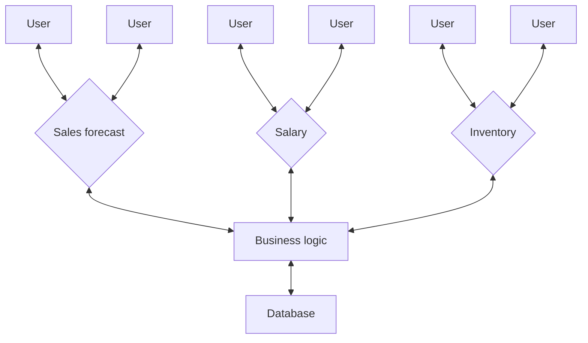
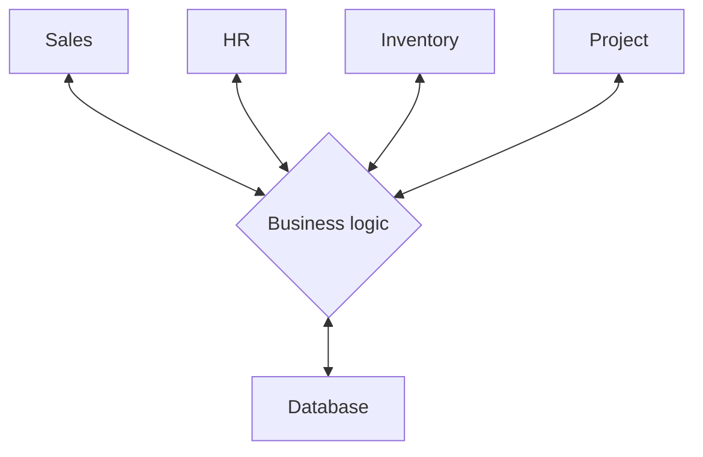

# Convert spreadsheets to Profitbase Workbooks

Profitbase Workbooks are web apps with data stored in a central database.
To address shortcomings of spreadsheets, consider moving to Profitbase Workbooks for any of the following reasons:  
<br/>   

#### 1. Enable distributed input with multiple contributors
To get input from different users through spreadsheets like Excel or Google Sheets, you need to make copies and share them via email or file shares. You then need to collect, consolidate and reconcile the data when users has completed their input. Needless to say, when the number of users grow, this process becomes error prone and time consuming.

With Profitbase Workbooks, you only share a link to a browser app. When users open the app in the browser, the built-in access control system ensures they only see the screens and data they are authroize to see, for example only data for their department.  

Reports, filters, dropdown options, data grids, formulas, validation rules and other relevant data is loaded from the common data model. This guides users through the input process, making sure the input they provide follows business rules.

When users saves their work, the data is stored back to the central database through the common data model, eliminating the need to do manual collection, consolidation and reconciliation of data. 



#### 2. Apply security and access control
When users open a Profitbase Workbook, the built-in access control system ensures that they only see the screens and data they are authroized to see. This means that even if someone accidentally get a link to a Workbook, or get their access revoked, they will be blocked. 

Power users or administrators can easily manage access through the admin portal, and grant access to users or groups. The access control system is very flexible, but most commonly access is granted based on role and / or affiliation, for example which department or project users belong to.

#### 3. Versioning and revisions
"Versions and revisions" means different things depending on which context you are in. 
1) Versions and revisions of data, for example budget versions where you have to do multiple iterations to get to the goal.
2) Versions and revisions of data models and business logic for existing data. For example, you need to change existing calculations or add more business logic and analysis. 

Profitbase has built-in, out-of-the-box features for handling both of these scenarios.

#### 4. Automate collection, consolidation, and reconciliation of data
Profitbase Workbooks share a common data model and stores all information in a central database. The common data model consolidates user input in a single repository, and ensures data integrity and consistent formats.
Common challenges with spreadsheets like varying data structures, units or measures, duplicate entries, inconsistent use of ids (e.g customer IDs, order IDs), data formats, and incorrect formulas are eliminated with Profitase Workbooks because of the common data model. It is the single source of truth for data input, reports, dropdowns, and filters, and ensures that user input adheres to business rules. Between the user interface and the data model sits the business logic middleware, which is reposible for transforming, validating and processing data between the format it is presented in, and the format it is stored in.  



#### 5. Handle large and complex models
**Data size**  
Spreadsheets like Excel and Google Sheets have limitations on both data size (rows and columns) and complexity (formulas). Currently, both Excel and Google Sheets have practical limits of around 1 million rows. However, financial models for even small to mid-sized companies often require handling 10–100 million rows, far exceeding these constraints.

Profitbase Workbooks does not have an upper limit to how large models can be, because cloud-based databases and calculations are leveraged (You can also run Profitbase on-prem). When users make changes and save their work, only the portion of the model affected by the edits are reprocessed in the cloud. This ensures that even with large models exceeding 100 million rows, updates are applied almost instantly - usually in less than a second.

**Complexity**  
Business logic in large spreadsheets is often difficult to understand because it relies on a tangled web of formulas and cell references with meaningless names. You quickly loose track when navigating between cells and sheets to piece together how everything works. Also, the lack of capabilities to document and test formulas or parts of the model in isolation, makes building and maintaing complex spreadsheets hard.

In Profitbase Workbooks, business logic is separated from data rendering, with logic defined in code and data displayed in the UI. While this is conceptually similar to using VBA in Excel for calculations, it is fundamentally different because the logic operates on actual _data_ rather than cell or sheet _addresses_. This approach allows you to read the business logic sequentially—top to bottom, left to right—without constant context switching. Moreover, because the logic is expressed in code, it uses meaningful names instead of cell references, making calculations easier to read, understand, and maintain. As the example below shows, you can also include comments directly with the code, making it easy to document what it does.

##### Example

Profitbase Workbook formula written in C# or JavaScript. Notice the inclusion of comments, explaining what the formula does:  
```csharp
// Calculate the sales amount including VAT
Model.SalesAmount = Input.Amount + Input.Amount * Parameters.VAT;
```

Equivalent Excel formula. What F3 and Parameters!B2 refers to is not immediately obivious:
```excel
=F3+F3*Parameters!B2
```

#### 6. Ensure consistency and reliability
If you share spreadsheets via email or file shares, can you be confident that users does not accidently modify or delete formulas, breaks links or data source connections? Can you be sure you are getting back the same version of the spreadsheet that you sent out? Can you be sure  everyone is using the same assumptions and parameters?

Profitbase Workbooks restrict end users to _editing only data_, not formulas, data connections, or business logic. Modifications to business logic and configuration are limited to power users. Additionally, the built-in access control system ensures users can only view and edit the data they are authorized to access. This guarantees everyone works with the same up-to-date model, assumptions, parameters, and formulas. As users input data, it is immediately synchronized with the central database, ensuring consistency and up-to-date data across the system.

#### 7. Eliminate key person dependency
Too often, only a single person fully understands the spreadsheet model, and they are the only one who can make changes without risking breaking it. What if this person leaves the company or becomes unavailable for any reason?  

Considering Profitbase Workbooks are also built by people, the main difference is the tools and technology used to build the solutions as described in [section 5 above](#5-handle-large-and-complex-models). Because the tools makes the models easier to understand, maintain, and modify by other users besides the original author, this removes the dependency on a single person. Obviously, understanding the business is still required, but the technical aspects (like formulas and data flows) are greatly simplified. 


