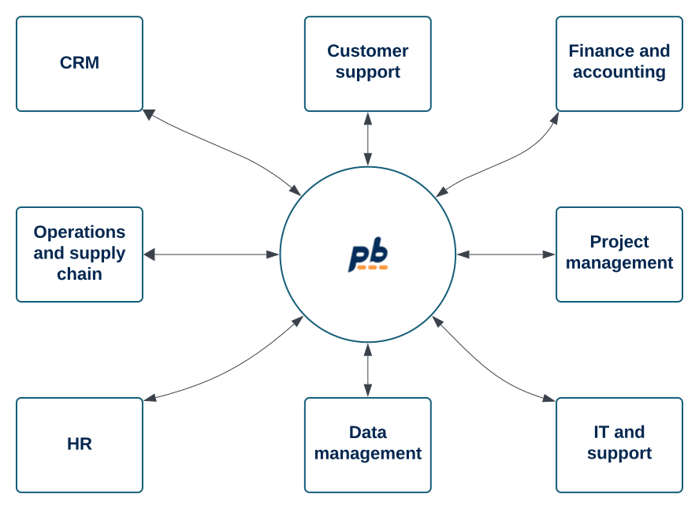
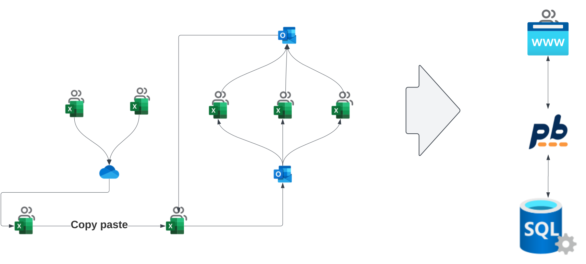
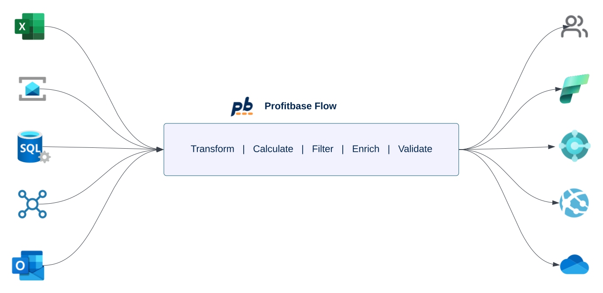

# Business Process Automation

Connect systems, automate repetitive tasks, reduce errors, and free your team to focus on value-adding activities. Whether tracking inventory, managing budgets, or generating reports, automation brings precision and efficiency to your processes.

 

## Integrate disconnected workflows

    

        
    

    

        
            Integrate and orchestrate disconnected workflows across teams and departments into a unified system to enhance visibility, foster collaboration, and achieve better business outcomes.
        
        <ul class="box-list">
            <li>Break data out of silos using automatic dataflows and integrations.    <a href="data-integration-and-transformation.md" class="new-custom-link">Read more</a></li>
            <li>Continuously track events and data, and alert the right people when action is needed.</li>
            <li>Display cross-functional KPIs, goals, and progress using tools like Power BI.</li>
        </ul>        
    

 
 

## Transform manual, spreadsheet-driven processes

    

            
                Transform fragile, disconnected and complex spreadsheet workflows into robust, collaborative and easy-to-use apps with built-in automation.
            
            <ul class="box-list">
                <li>Convert disparate spreadsheets into web applications with data stored in a centralized database.</li>
                <li>Automate data collection, consolidation and reconciliation.</li>
                <li>Reduce errors by defining business rules and formulas that users cannot break.</li>
                <li>Build, manage and publish low-code apps.</li>
                <li>Control user access and permissions to display only relevant information.</li>
            </ul>        
     

    

        
    

    

 
 

## Connect business systems through APIs and automated dataflows

    

        
    

    

        
            Create seamless connections between business applications with automated dataflows to enable live data synchronization, ensuring accurate and up-to-date information across all systems.
        
        <ul class="box-list">
            <li>Eliminate the need for manual data entry.</li>
            <li>Easily move data between different systems.   <a href="data-integration-and-transformation.md" class="new-custom-link">Read more</a></li>
            <li>Run automations on a schedule, in response to events, or through APIs from third-party apps.</li>
            <li>Build, manage and automate integrations with drag and drop or code.</li>
        </ul>        
    

 
 

## Process documents and files

Automate the capture, classification, and routing of documents and files. Use Profitbase to extract data, validate, transform, and ensure compliance. Whether it’s invoices, contracts, or internal records, document automation saves time and ensures accuracy at every step.  

-	Ingest files from emails, file shares, and APIs 
-	Extract and transform data from multiple formats including PDF, Excel, JSON, XML, and images
-	Convert files between different formats
-	Upload, download, classify, and manage documents and files

