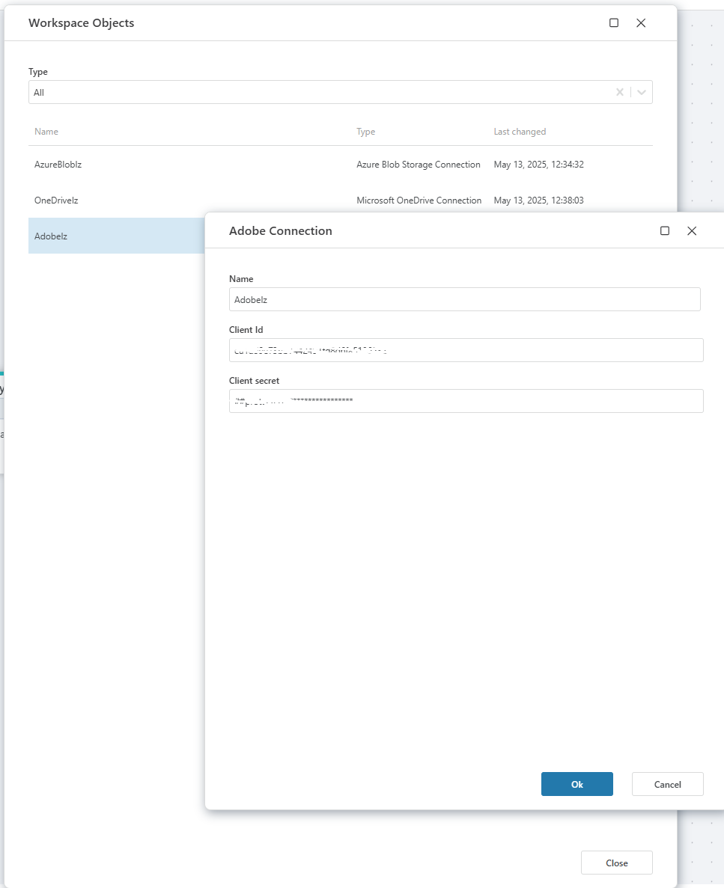

# Connecting to Adobe PDF Services

When adding an [Adobe PDF Services](https://opensource.adobe.com/pdftools-sdk-docs/release/latest/index.html) action, select an [existing connection](../../workspaces/workspace-objects.md) or create a new one.

## Connection details

**Adobe connection**, enables integration with **Adobe PDF Services**. This connection uses the **Client ID** and **Client Secret** provided by Adobe. 

| Field           | Description                                                                 |
|-----------------|-----------------------------------------------------------------------------|
| Name            | Name of the connection.                                                     |
| Client Id       | The client identifier obtained from the Adobe Developer Console.            |
| Client secret   | A secure key paired with the client ID, used to authenticate API requests.  |

 

> [!NOTE]
> To use any of the Adobe service actions, you must first create and configure Adobe API credentials. This is a required step for all nodes that use Adobe services.
> 
> These credentials allow Profitbase Flow to authenticate with your Adobe account and access the necessary resources.

### Create Adobe API Credentials

Follow Adobe's documentation to:

1. Register your application in the Adobe Developer Console.

2. Generate the necessary credentials (e.g., Client ID, Client Secret, Technical Account ID).

3. Grant the required permissions for the APIs you intend to use.

Once created, these credentials must be added to the Adobe connection configuration in Flow. For detailed instructions, see the [Adobe Developer Console credentials guide](https://developer.adobe.com/developer-console/docs/guides/credentials).

### Creating a new connection

To create a new connection:

1. Enable the **Create new connection** toggle.
2. Enter the required connection details:
   - **Connection name**: Provide a meaningful name for your connection.
   - **Client ID**: Enter your Adobe API client ID.
   - **Client secret**: Enter your Adobe API client secret.
3. Test/Click **OK** to save the connection.

