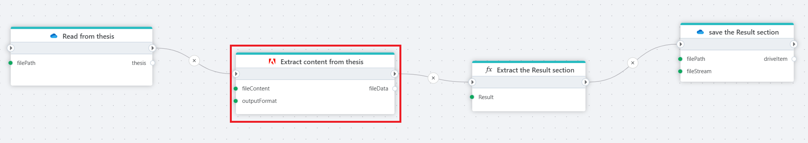
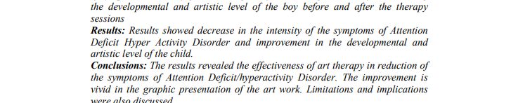

# Extract content from PDF as byte array

Extract the content from a PDF file and returns a json structure based on the extract option property as a byte array.

# Extract content from PDF as byte array

Extract the content from a PDF file and return it as a JSON structure based on the selected `outputFormat`.  
The input is provided as a byte array (typically via a file read block). This action uses **Adobe PDF Services** to extract textual and structural content from PDF documents.



**Example**  
  
This flow reads a thesis PDF from cloud storage, extracts its content using Adobe PDF Services with the `JsonStructured` format, transforms the output, and stores it in a new file.

---

## Properties

| Name            | Type     | Required | Description                                                                 |
|-----------------|----------|----------|-----------------------------------------------------------------------------|
| `fileContent`   | Input    | Yes      | Byte array of the PDF file to be parsed (e.g., from `Read from file`).     |
| `outputFormat`  | Input    | Yes      | Defines the structure of the extracted result. Options: `Raw`, `Simplified`, `JsonStructured`. |
| `fileData`      | Output   | No       | Name of the variable to store the extracted result. Defaults to `fileData`. |

---

## Output format options

### `Raw`
- Contains low-level layout and styling metadata such as bounding boxes, fonts, position coordinates, justification, line height, etc.
- Best for use cases where exact PDF layout reproduction or fine-grained analysis is needed.

### `Simplified`
- Extracts only plain text, organized by page.
- Suitable for basic text search and lightweight parsing.

### `JsonStructured`
- Outputs a tree structure reflecting logical document elements (`heading`, `paragraph`, `table`, etc.).
- Best choice for semantically meaningful documents like theses, reports, contracts.

---

## Example comparison

### Input PDF





### Output (Raw)

```json
{
  "elements": [
    {
      "Bounds": [126.02, 315.34, 488.76, 358.76],
      "Font": {
        "family_name": "Times New Roman",
        "weight": 700
      },
      "Lang": "en",
      "page": 6,
      "path": "/Document/P[6]",
      "text": "Results: Results showed decrease in the intensity of the symptoms of Attention-Deficit/Hyperactivity Disorder...",
      "TextAlign": "Justify"
    }
  ]
}
```

### Output (Simplified)

```json
{
  "elements": [
    {
      "page": 6,
      "path": "/Document/P[6]",
      "text": "Results: Results showed decrease in the intensity of the symptoms of Attention-Deficit/Hyperactivity Disorder..."
    }
  ]
}
```

### Output (JsonStructured)

```json
{
  "children": [
    {
      "elementType": "p",
      "value": "Results: Results showed decrease in the intensity of the symptoms of Attention-Deficit/Hyperactivity Disorder...",
      "page": 6,
      "children": []
    }
  ]
}
```