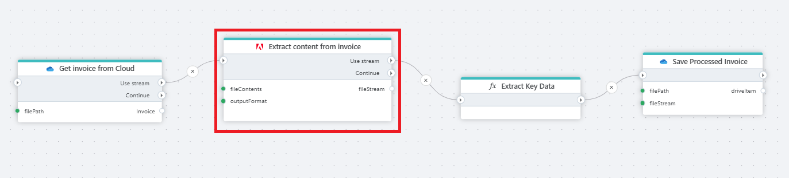

# Extract content from PDF as stream


Extracts content from a PDF file and returns it as stream.
The input is provided as a stream. This action uses **Adobe PDF Services** to extract textual and structural content from PDF documents.



**Example**   
This flow reads an invoice PDF from cloud storage, extracts its content using Adobe PDF Services in stream format, processes the output to extract the relevant result section (e.g., total amount or service details), and saves the result in a new file.


## Properties

| Name            | Type     | Description                                                                 |
|-----------------|----------|-----------------------------------------------------------------------------|
| fileContent   | Required   | Byte array of the PDF file to be extracted.     |
| outputFormat  | Required     | Defines the structure of the extracted result. Options: `Raw`, `Simplified`, `JsonStructured`. |
| fileData      | Optional   | Name of the variable to store the extracted result. Defaults to `fileData`. |


## Output format options

**Raw**
- Contains low-level layout and styling metadata such as bounding boxes, fonts, position coordinates, justification, line height, etc.
- Best for use cases where exact PDF layout reproduction or fine-grained analysis is needed.

**Simplified**
- Extracts only plain text, organized by page.
- Suitable for basic text search and lightweight parsing.

**JsonStructured**
- Outputs a tree structure reflecting logical document elements (`heading`, `paragraph`, `table`, etc.).
- Best choice for semantically meaningful documents like theses, reports, contracts.


## Example


**Output (JsonStructured)**

```json
           {
              "elementType": "TR",
              "page": 0,
              "children": [
                {
                  "elementType": "TH",
                  "page": 0,
                  "children": [
                    {
                      "elementType": "P",
                      "value": "Total Amount ",
                      "page": 0,
                      "children": []
                    }
                  ]
                },
                {
                  "elementType": "TD",
                  "page": 0,
                  "children": [
                    {
                      "elementType": "P",
                      "value": "$24.91 USD ",
                      "page": 0,
                      "children": []
                    }
                  ]
                }
              ]
            },
```

**Output (Simplified)**

```json
    {
      "page": 0,
      "path": "//Document/Sect/Table[4]/TR[3]/TH/P",
      "text": "Total Amount "
    },
    {
      "page": 0,
      "path": "//Document/Sect/Table[4]/TR[3]/TD/P",
      "text": "$24.91 USD "
    },
```


