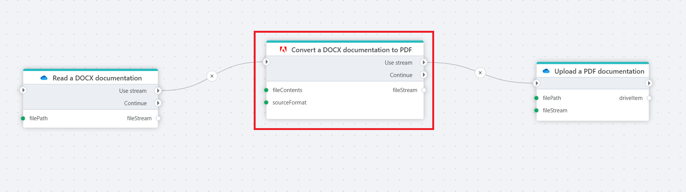

# Convert a non-PDF file to a PDF file as stream

Converts a non-PDF file (Word, image, PowerPoint, etc) to PDF and returns it as a stream object.

**Example**   
This flow takes a documentation file (in DOCX format) from [OneDrive](../onedrive/read-file-from-onedrive-as-stream.md), sends it to the [Adobe PDF Services](https://developer.adobe.com/document-services/docs/overview/pdf-services-api/) as stream, where it is converted into a PDF format, and then [uploads](../onedrive/upload-file-to-onedrive.md) it to the selected folder in OneDrive.

## Properties

| Name                   | Type     | Description                                                                                                                                                     |
|------------------------|----------|-----------------------------------------------------------------------------------------------------------------------------------------------------------------|
| Connection         | Required | The connection to the [Adobe PDF Services](https://developer.adobe.com/document-services/docs/overview/pdf-services-api/).                                          |
| Source format      | Required | The format from which the PDF will be converted. |
| File contents      | Required | The input file data as stream.      |
| Result variable name | Optional | The name of the variable in which the resulting file (converted document) will be stored. This variable can be used in subsequent steps of the flow.            |
| Description        | Optional | A user-defined description for the action, helpful for documentation or identifying the step's purpose within a larger flow.     |

 

## Returns

Returns a file in the chosen format as a [Stream](https://learn.microsoft.com/en-us/dotnet/api/system.io.stream).

 

[!INCLUDE ]