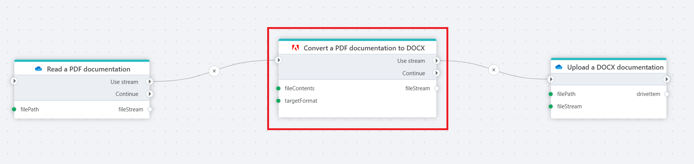

# Convert a PDF file to a non-PDF file as stream

Converts a PDF file to a target format and returns it as a stream.

**Example**   
This flow takes documentation in a PDF file from [OneDrive](../onedrive/read-file-from-onedrive-as-stream.md), sends it to the [Adobe PDF Services](https://opensource.adobe.com/pdftools-sdk-docs/release/latest/index.html) as stream, where it is converted into a DOCX format, and then [uploads](../onedrive/upload-file-to-onedrive.md) it to the selected folder in OneDrive.

## Properties

| Name                   | Type     | Description                                                                                                                                                     |
|------------------------|----------|-----------------------------------------------------------------------------------------------------------------------------------------------------------------|
| Connection         | Required | The connection to the [Adobe PDF Services](https://opensource.adobe.com/pdftools-sdk-docs/release/latest/index.html).                                          |
| Target format      | Required | The format to which the PDF will be converted. Available formats are DOC, DOCX, PPTX, RTF and XLSX.                                                                              |
| File contents      | Required | The input file data as stream.      |
| Result variable name | Optional | The name of the variable in which the resulting file (converted document) will be stored. This variable can be used in subsequent steps of the flow.            |
| Description        | Optional | A user-defined description for the action, helpful for documentation or identifying the step's purpose within a larger flow.     |

## Returns

Returns a file in the chosen format as a [Stream](https://learn.microsoft.com/en-us/dotnet/api/system.io.stream).