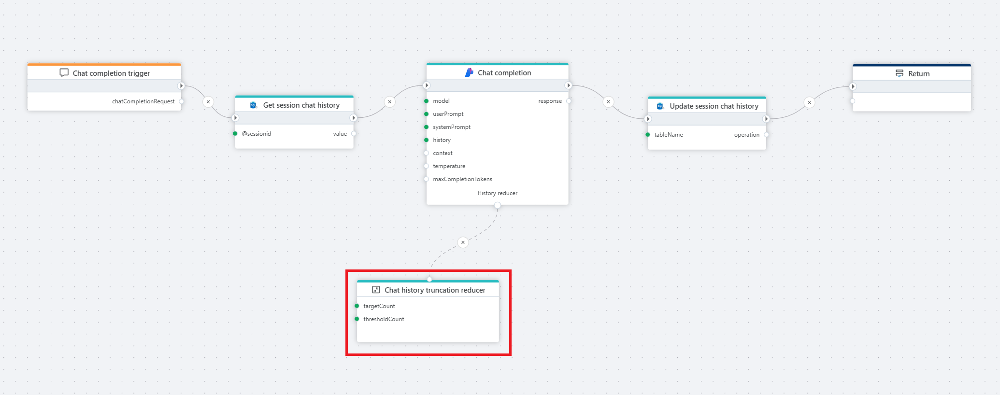

# Chat History Truncation Reducer

Defines a chat history reducer that trims the conversation to a target number of messages, but only when the total exceeds a specified threshold.
If no threshold is set, the history is trimmed whenever it exceeds the target count.




**Example**   
This flow ensures chat history is dynamically managed and trimmed, keeping interactions relevant while staying within context window limits of the model. The **Chat History Truncation Reducer** is  automatically discarding the oldest entries when the chat becomes too long.


## Properties 

| Name                    | Type      | Description                                           |
|-------------------------|-----------|-------------------------------------------------------|
| Title                   | Optional  | The name of the action or operation.                  |
| Target count            | Required  | The desired number of target/history messages after reduction           |
| Threshold count         | Optional  | The number of messages beyond the 'targetCount' that must be present in order to trigger reduction           |
| Description             | Optional  | A field to describe the action or its purpose.        |

</br>


**Typical use case:** The Chat Completion History Reducer is used to automatically trim older, less relevant messages from a growing conversation, ensuring that large language models stay within context limits while maintaining a coherent and focused dialogue.

The reducer helps:

- **Preserve important context** by keeping recent messages.
- **Avoid overload** from excessively long conversations.
- **Improve model performance** by maintaining clarity and relevance.

It’s particularly useful in long-running sessions or applications like customer service bots, AI companions, or collaborative coding assistants.

## History JSON Format

```json
{
[
  {
    "Role": "User",
    "Content": "Give me name and describtion of the random element from the periodic table.",
    "IsSummary": null
  },
  {
    "Role": "Assistant",
    "Content": "Element: Sodium (Na)\n\nDescription: Sodium is a chemical element with the atomic number 11. It is a soft, silvery-white, highly reactive metal and belongs to the alkali metal group. Sodium is known for its ability to react vigorously with water, producing hydrogen gas and sodium hydroxide. It is essential for biological processes, as it helps maintain fluid balance and is crucial for nerve function in living organisms. Sodium is commonly found in nature in the form of sodium chloride (table salt) and is widely used in various industrial applications, including the production of chemicals and as a heat exchanger in some nuclear reactors.",
    "IsSummary": null
  },
  {
    "Role": "User",
    "Content": "Give me name and describtion of the random element from the periodic table.",
    "IsSummary": null
  },
  {
    "Role": "Assistant",
    "Content": "Element: Neon (Ne)\n\nDescription: Neon is a chemical element with the atomic number 10. It is a colorless, odorless noble gas that is inert under most conditions. Neon is known for its distinct reddish-orange glow when electrified, making it popular for use in neon signs and lighting. It is found in trace amounts in the Earth\u0027s atmosphere and is extracted through fractional distillation of liquefied air. Neon has few commercial applications beyond lighting, but its unique properties and bright colors make it a staple in decorative lighting and advertising.",
    "IsSummary": null
  },
  {
    "Role": "User",
    "Content": "Give me name and describtion of the random element from the periodic table.",
    "IsSummary": null
  },
  {
    "Role": "Assistant",
    "Content": "Element: Iron (Fe)\n\nDescription: Iron is a chemical element with the atomic number 26. It is a metallic element known for its strength and durability, and it is one of the most abundant elements on Earth. Iron is essential for the production of steel, which is a crucial material in construction, manufacturing, and various industries. It is also important biologically, as it is a key component of hemoglobin, the protein in red blood cells that carries oxygen throughout the body. Iron can rust when exposed to moisture and oxygen, forming iron oxide. It is typically found in nature in ores, such as hematite and magnetite.",
    "IsSummary": null
  }

  ...

]
}
