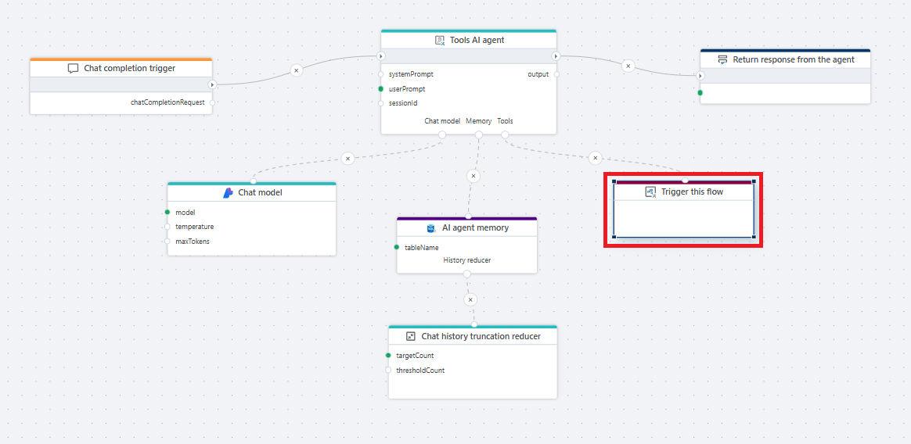
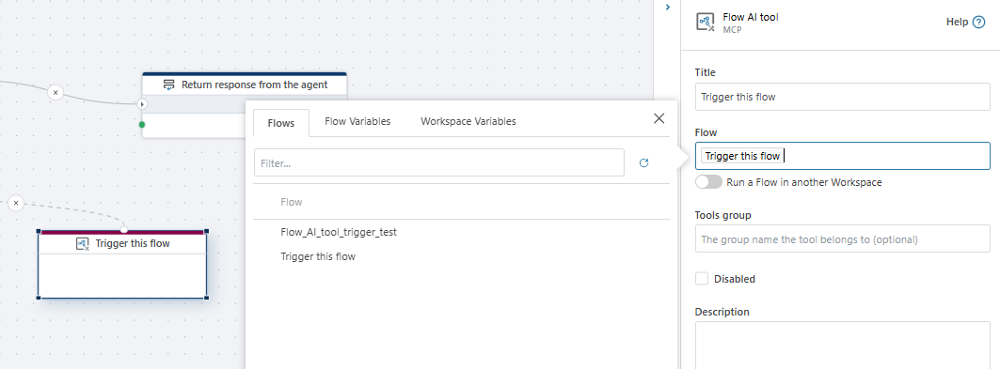

# Flow AI tool

Specifies a Flow that enables the [Tools AI Agent](../agents/tools-ai-agent.md) to use it as a tool.  

**Example**   
This flow demonstrates how an AI agent uses the **Flow AI tool** to invoke another flow as part of handling a chat request. The agent processes the user message using a chat model and maintains conversation context in memory ([AI agent memory](../sql-server/agent-memory.md)). The connected flow is always invoked through the **Flow AI tool**, and the called flow is exposed using the [Flow AI tool trigger](../../triggers/ai/flow-ai-tool-trigger.md). The result is then used by the agent to generate and [return](../built-in/return.md) the final response to the caller.

 

> [!NOTE]
>  You can only select Flows with a [Flow AI tool trigger](../../triggers/ai/flow-ai-tool-trigger.md).

## Properties

| Name                         | Type     | Description                                                                 |
|------------------------------|----------|-----------------------------------------------------------------------------|
| Title                        | Optional | The name of the Flow AI tool as exposed to the AI agent. When a flow is selected from the list, the title is automatically set to the name of the flow.     |
| Flow                         | Required | The flow that will be invoked by the AI agent when this tool is called.    |
| Run a Flow in another Workspace | Optional | Allows invoking a flow from a different workspace.                         |
| Tools group                  | Optional | Logical group name used to organize tools available to the AI agent.       |
| Disabled                     | Optional | Disables the tool so it cannot be invoked by the AI agent.                 |
| Description                  | Optional | Description of what the tool does, used by the AI agent to understand its purpose. |
