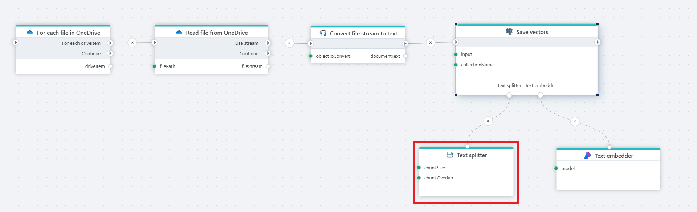

# Text splitter

Defines a Text splitter object that can be used in various AI-related nodes with a "Text splitter" port. 

**Example**   
This flow [reads](../onedrive/read-file-from-onedrive-as-byte-array.md) files from OneDrive, [converts](../built-in/convert.md) their content to text, splits it into chunks, generates [embedding](../azure-ai/text-embedder.md) vectors, and [stores](../postgresql/vector-save.md) them in a PostgreSQL database for semantic search.

 

## Properties

| Name                  | Type     | Description                                                                 |
|-----------------------|----------|-----------------------------------------------------------------------------|
| Name                 | Optional | The name of the action or operation.                                       |
| Splitter type         | Required | Read documentation below.                           |
| Result variable name  | Optional | Contains the `TextSplitter` object created by this node.                   |
| Description           | Optional | User-defined explanation or context for the node’s purpose.                |

### Splitter type

**Required.** Allows selection of a splitting type (algorithm). Based on the selected type, a number of additional properties will be shown.

 

**Recursive character text splitter:**

Splits text by characters into chunks of a specified size, optionally allowing overlap for better context retention.

**Additional properties**

| Name          | Type     | Description                                                   |
|---------------|----------|---------------------------------------------------------------|
| Chunk size    | Required | The number of characters to split after.                      |
| Chunk overlap | Optional | The number of common characters in two consecutive chunks.     |

 

**Token text spiltter:**

Divides text based on token count using a chosen encoding, useful for models with token limits.

**Additional properties**

| Name          | Type     | Description                                                                 |
|---------------|----------|-----------------------------------------------------------------------------|
| Encoder name  | Optional | The encoder that will count the tokens.                                     |
| Max tokens    | Required | The maximum number of tokens in a chunk.                                    |
| Chunk overlap | Optional | The number of common tokens in two consecutive chunks.                      |

 

**Markdown header text splitter:**

Breaks down documents at specific Markdown headers, ideal for structured texts like articles or reports.

**Additional properties**

| Name              | Type     | Description                                                                 |
|-------------------|----------|-----------------------------------------------------------------------------|
| Headers to split on | Optional | The markdown headers to split on.                                           |
| Include header      | Optional | Denotes if the headers themselves should be included in the output.         |

 

## Returns

**Text splitter** – Contains the `TextSplitter` object created by this node.