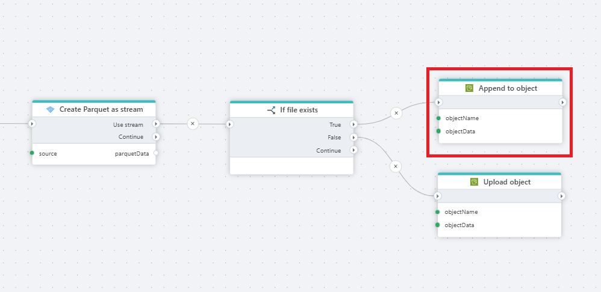

# Append to S3 object

Appends a byte array or Stream to an [Amazon S3 ](https://docs.aws.amazon.com/s3/?nc2=h_ql_doc_s3)object.

## Properties

| Name        | Type     | Description                                                                                 |
| ----------- | -------- | ------------------------------------------------------------------------------------------- |
| Title       | |                                                                                             |
| Connection  | Required | Access key id, access key secret, bucket name and region connecting to an Amazon S3 bucket. |
| Object name | Required | The name of the object to append to. If the object doesn't exist yet, it will be created.        |
| Object data        | Required  | The data to append. It must be a byte array or [Stream](https://learn.microsoft.com/en-us/dotnet/api/system.io.stream) |
| Description | Optional | Additional notes or comments about the action or configuration.  |
