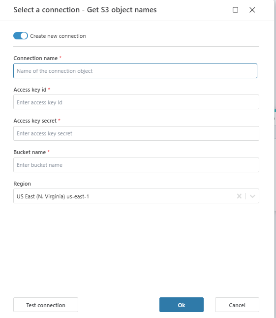

# Connecting to Amazon S3

When adding an [Amazon S3](https://docs.aws.amazon.com/appstudio/latest/userguide/connectors-s3.html) action, select an [existing connection](../../workspaces/workspace-objects.md) or create a new one.

### Prerequisites

Before configuring the connection, you will need the following:

- **Access Key ID**

- **Secret Access Key**

- **Region**

- **Bucket Name**

You can generate these credentials in the [AWS IAM Console](https://docs.aws.amazon.com/IAM/latest/UserGuide/id_credentials_access-keys.html). Ensure the user has appropriate permissions to access the S3 bucket.

### Connection details

An Amazon S3 connection consists of the following fields:

| Field             | Description                                                          |
| ----------------- | -------------------------------------------------------------------- |
| Connection name   | Name of the connection.                                              |
| Access key ID     | A unique identifier assigned by AWS that, along with the secret access key, is used for authentication when accessing AWS services. It is part of the AWS security credentials.                      |
| Access key secret | A confidential key that works together with the access key ID to authenticate API requests. This key must be kept secure and should never be shared or hardcoded in public repositories.                  |
| Bucket name       | The specific name of the Amazon S3 bucket that this connection is linked to. The bucket name must be unique across all AWS accounts and comply with AWS naming conventions.           |
| Region           | The AWS region where the S3 bucket is located.                      |

 

### Creating a new connection

To create a new connection:
1. Enable the **Create new connection** toggle.
2. Enter the required connection details:
   - **Connection name**: Provide a meaningful name for your connection.
   - **Access key ID**: Enter your AWS access key ID.
   - **Access key secret**: Enter your AWS secret access key.
   - **Bucket name**: Specify the S3 bucket name.
   - **Region**: Select the appropriate AWS region (e.g., `us-east-1`).
3. Click **Test connection** to verify your credentials.
4. If successful, click **OK** to save the connection.

