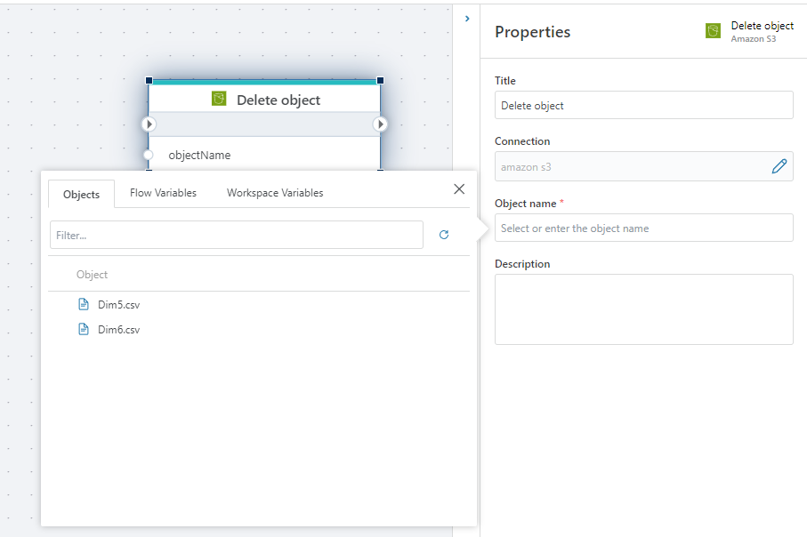

# Delete S3 object

Deletes a S3 object from a bucket.

## Properties

| Name        | Type     | Description                                                                                 |
| ----------- | -------- | ------------------------------------------------------------------------------------------- |
| Title       | Optional |  The title of the action.   |
| Connection  | Required | Specify the [connection](connecting-to-amazon-s3.md) to the Amazon S3 bucket. |
| Object name | Required | The name of the object to delete.                                                           |
| Description | Optional |  Additional notes or comments about the action or configuration. |
