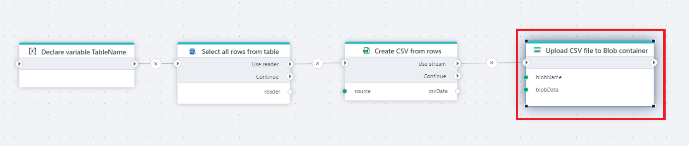

# Upload Amazon S3 object

Uploads a byte array or [Stream](https://learn.microsoft.com/en-us/dotnet/api/system.io.stream) to an Azure Blob container.

 

## Properties

| Name             | Type      |Description                                             |
|------------------|-----------|--------------------------------------------------------|
| Connection       | Required  | A [SAS Uri](https://learn.microsoft.com/en-us/azure/storage/common/storage-sas-overview) to an Azure Blob container.       |
| Blob name        | Required  | The name of the blob (file)  |
| Blob data        | Required  | The data to upload. It must be a byte array or [Stream](https://learn.microsoft.com/en-us/dotnet/api/system.io.stream) |
| Overwrite if blob already exists | Optional | If not checked, the action will fail if a blob with the same name already exists. |

