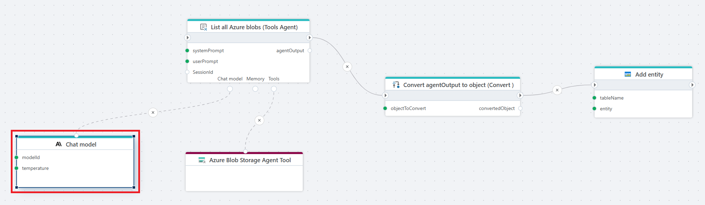

# Chat model

Defines an **Anthropic chat model** that an AI Agent can use to generate responses, reason about inputs, and support intelligent automation within Flow.

**Example**   
This flow uses an AI Agent powered by an Anthropic chat model to retrieve a list of blobs from Azure Blob Storage and store the results in a table.

## Properties

| Name                   | Type      | Description |
|------------------------|-----------|-------------|
| Title              | Optional  | The display name of the action in your flow. |
| Connection         | Required  | Defines the [connection](anthropic-connection.md) to **Anthropic**. The connection provides the API key needed to access Anthropic models. |
| Model Id           | Required  | The identifier of the Anthropic model to use (e.g., `claude-3-5-sonnet-latest`, `claude-3-opus-latest`). The model determines the capability, response quality, and cost. |
| Temperature        | Optional  | Controls the creativity and randomness of the model’s output. Accepts values from 0.0 to 1.0 (default 1.0). Lower values produce more precise and deterministic responses, while higher values (closer to 1.0) generate more varied and creative text. |
| Max completion tokens | Required | Defines the maximum number of tokens the model may generate in its response. Helps control output length and cost. |
| Result variable name | Optional | The name of the variable where the generated output will be stored. Defaults to `chatModel`. |
| Description        | Optional  | Additional notes or context about the action. |

 

