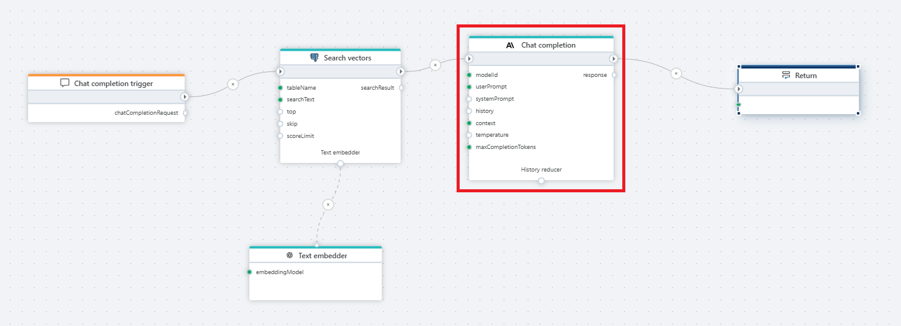

# Chat completion

This defines an [Anthropic](https://docs.claude.com/en/api/overview) chat completion model that processes a prompt, understands the user’s intent, and generates the next response. Using chat completion provides structured reasoning, allows the model to follow context, and helps maintain a coherent dialogue.  

This action is typically used in flows where you need the model’s complete output in a single, finalized response instead of receiving partial tokens over time.
Unlike the [streaming](streaming-chat-completion.md) version, this action delivers the **complete output in one response**.

**Example**   
This flow processes a user's chat question by first receiving it through a [Chat completion trigger](../../triggers/ai/chat-completion-trigger.md), then converting it into a vector using a [Text embedder](text-embedder.md), performing a [Vector search](../postgresql/vector-search.md) in a PostgreSQL database for relevant context, and finally passing the user input and retrieved context to OpenAI **Chat completion**, which generates a response that is returned to the client via the [Return](../built-in/return.md) node.

 

## Properties

| Name                    | Type      | Description |
|-------------------------|-----------|-------------|
| Title               | Optional  | The title of the action. |
| Connection          | Required  | Defines the [connection](anthropic-connection.md) to Anthropic. The connection provides the API key needed to access Anthropic models. |
| Model Id            | Required  | The Anthropic model ID to use (e.g., `claude-3-5-sonnet-latest`). |
| User Prompt         | Required  | The user's message to which the model should respond. |
| System Prompt       | Optional  | High-level instructions guiding the model’s behavior, tone, and response style. |
| History             | Optional  | A list of previous messages that helps the model maintain continuity across the conversation. |
| Context             | Optional  | Additional domain or RAG-based context injected into the prompt. Supports plain text or vector search results. |
| Prompt Template     | Optional  | Defines the structure of the message sent to the model. The placeholders `@@context` and `@@userPrompt` will be automatically replaced with their values. |
| Temperature         | Optional  | Controls the creativity and randomness of the model’s output. Lower values produce more precise and deterministic responses, while higher values (closer to 1.0) generate more varied and creative text. |
| Max Completion Tokens | Optional | The maximum number of tokens the model may generate in its response. |
| Result Variable Name | Optional | The variable that will store the model's final output. Default: `"response"`. |
| Description         | Optional  | Additional notes or metadata for the action. |

 

## Returns

An **AIChatCompletionResponse** (Profitbase.Flow.Extensions.AI.AIChatCompletionResponse).

 

## Prompt template

The Prompt Template allows you to define the final structure of the prompt sent to Anthropic.  
This is useful when combining user input with retrieved context or applying structured instructions.

You can use the following placeholders inside the template:

- `@@context` — replaced with the **Context** value  
- `@@userPrompt` — replaced with the **User Prompt** value  

Before calling the model, the system merges template values into a single finalized prompt.
