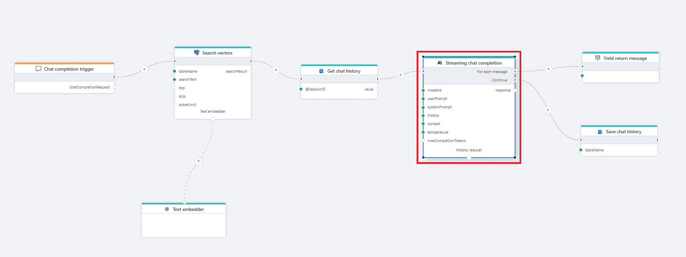

# Streaming chat completion

Streams the response from a chat completion model one message at a time, allowing you to handle partial output in real time until the full response is completed.  
This action is typically used when building backends for interactive chat clients, assistant-like experiences, or any UI that needs incremental model output.

**Example**   
The Flow above shows how to provide real-time completions to a chat client. External data sources may be added — for example vector search for RAG or a chat history store — to give the model additional context and support follow-up questions.

 

## Properties

| Name                    | Type      | Description |
|-------------------------|-----------|-------------|
| Title               | Optional  | The title of the action. |
| Connection          | Required  | Defines the [connection](anthropic-connection.md) to **Anthropic**. The connection provides the API key needed to access Anthropic models. |
| Model Id            | Required  | The Anthropic model ID you want to use (e.g., `claude-3-5-sonnet-latest`). |
| System Prompt       | Optional  | High-level instructions that set the behavior, tone, and rules for the model. |
| User Prompt         | Required  | The user message that the model responds to. |
| History             | Optional  | Previous messages in the conversation. Helps the model maintain context and continuity. |
| Context             | Optional  | Additional information injected into the prompt, often used with RAG to improve accuracy. Supports plain text or vector search results. |
| Prompt Template     | Optional  | Defines the final prompt structure. The placeholders `@@context` and `@@userPrompt` will be automatically replaced. |
| Temperature         | Optional  | Controls the creativity and randomness of the model’s output. Accepts values from 0.0 to 1.0 (default 1.0). Lower values produce more precise and deterministic responses, while higher values (closer to 1.0) generate more varied and creative text. |
| **Max Completion Tokens** | Required | Maximum number of tokens the model can generate in its response. |
| **Stream Variable Name | Optional | The variable name that receives each streamed message chunk. Default: `message`. |
| Result Variable Name | Optional | Stores the final combined response after streaming completes. Default: `response`. |
| Description        | Optional  | Additional notes or explanation for the action. |

 

## Prompt template

The **Prompt Template** defines how the message sent to Anthropic should be structured.  
It is useful when you want strict formatting or when combining user input with retrieved context.

The following placeholders are available:

- `@@context` — replaced with the **Context** value  
- `@@userPrompt` — replaced with the **User Prompt** value  

Before submitting the request, the system merges all template elements into a single final prompt.

