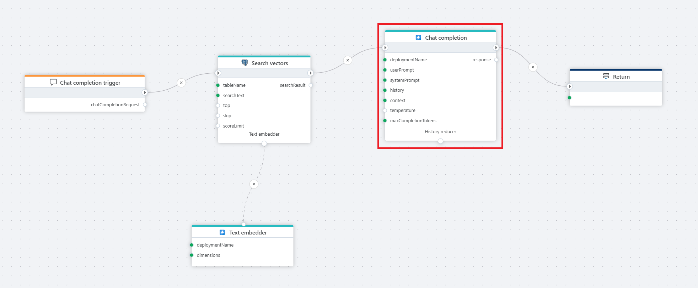
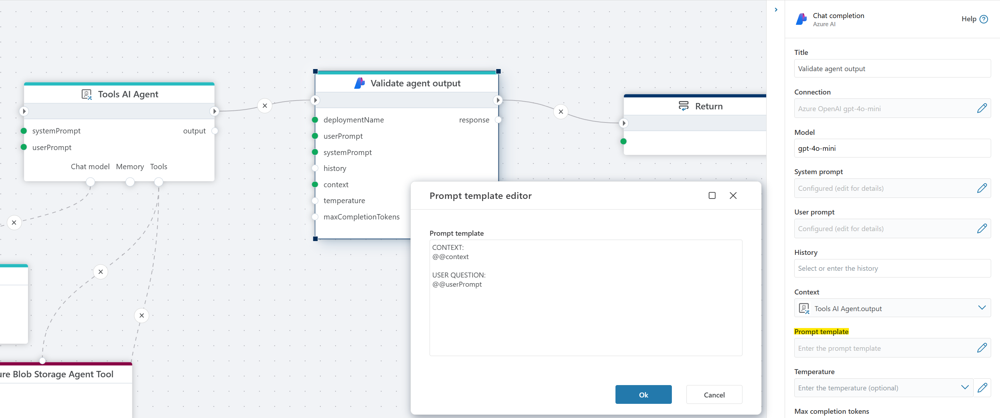

# Chat Completion

This defines an [Azure AI Foundry](https://ai.azure.com/) chat completion model that processes a prompt, understands the user’s intent, and generates the next response. Using chat completion provides structured reasoning, allows the model to follow context, and helps maintain a coherent dialogue.   

This action is typically used in flows where you need the model’s complete output in a single, finalized response instead of receiving partial tokens over time.
Unlike the [streaming](streaming-chat-completion.md) version, this action delivers the **complete output in one response**.

**Example**   
This flow processes a user's chat question by first receiving it through a [Chat completion](../../triggers/ai/chat-completion-trigger.md) trigger, then converting it into a vector using a [text embedder](../azure-ai/text-embedder.md), performing a [Vector search](../postgresql/vector-search.md) in a PostgreSQL database for relevant context, and finally passing the user input and retrieved context to an Azure AI **Chat completion** action, which generates a response that is returned to the client via the [Return](../built-in/return.md) node.

 

## Properties

| Name                  | Type      | Description |
|-----------------------|-----------|-------------|
| Title             | Optional  | The title of the action. |
| Connection        | Required  | Defines the [connection](azure-ai-connection.md) to **Azure AI Foundry** resource. |
| Model             | Required  | Specifies the model deployment name, which corresponds to the custom name chosen during model deployment in the Azure portal or in [Azure AI Foundry](https://ai.azure.com) ([see below](#models--endpoints)). In the Azure Portal, the deployment name can be found under **Resource Management** > **Model Deployments**. |
| User Prompt       | Required  | The input message from the user, which the model processes to generate a response. |
| System Prompt     | Optional  | A system-level instruction that guides the model’s behavior and response style. |
| History           | Optional  | A record of past interactions that provides context to the conversation, helping the model maintain continuity. |
| Context           | Optional  | Typically used for RAG, and provides additional information or domain-specific knowledge to the chat model so it can make more accurate responses. The input can be a string (text) or a vector search result, such as the result from the PostgreSQL [Vector Search](../postgresql/vector-search.md) action. |
| Prompt template   | Optional  | Defines the structure of the prompt sent to the model. The system replaces the placeholders @@context and @@userPrompt with the relevant information. See example below. |
| Temperature       | Optional  |Temperature in models controls the randomness and creativity of the generated responses. Lower temperatures (e.g., 0.2) produce more focused, predictable text, ideal for tasks that require precision. Higher temperatures (e.g., 1.5) increase creativity and variability, but may risk generating less coherent or relevant content, making it important to adjust based on your desired outcome.  The default is 0.7 if nothing is defined by the user.|
| Max Completion Tokens | Optional | Sets a limit on the number of tokens (words, characters, or pieces of text) in the model’s response. |
| Result Variable Name | Optional | Stores the generated AI response. Default: "response". |
| Description       | Optional  | Additional details or notes regarding the chat completion setup. |

 

#### Models + Endpoints
To find the Model deployment name, look in `Models + Endpoints` screen in [Azure AI Foundry](https://ai.azure.com).  

 

#### Prompt template

The prompt template allows you to specify the format of the prompt that is sent to the language model. This is useful for customizing how context and instructions are provided to the model.
Within the template, you can use the following placeholders:

- `@@context`: This is replaced by the "Context" property value.
- `@@userPrompt`: This is replaced by the "User prompt" property value.

The system will substitute these placeholders with the corresponding values before sending the prompt to the model.

**Example**  

  

 

[!INCLUDE ]