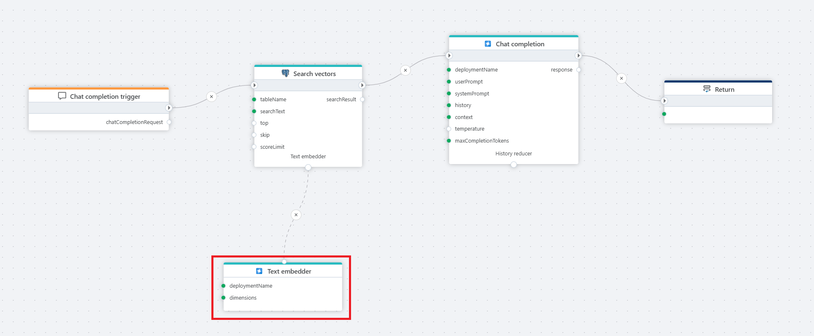

# Text embedder

Defines an Azure AI text [embedder](https://learn.microsoft.com/en-us/azure/ai-services/openai/how-to/embeddings?utm_source=chatgpt.com&tabs=console).  
It is used as a tool by actions such as [Search vectors](../sql-server/search-vectors.md) and [Save vectors](../sql-server/vector-save.md) to generate embeddings when reading or writing data to a vector store.  

**Example**   
This flow processes a user's chat question by first receiving it through a [Chat completion](../../triggers/ai/chat-completion-trigger.md) trigger, then converting it into an embedding vector using a **text embedder**, and performs a [Vector search](../postgresql/vector-search.md) in a PostgreSQL database for relevant context. The result from the vector search, along with the user input, is then passed to the [Chat completion](chat-completion.md), which generates the response which is returned to the client via the [Return](../built-in/return.md) node.

 

## Properties 

| Name                  | Type      | Description |
|-----------------------|-----------|-------------|
| Title                | Optional  | The title of the action. |
| Connection           | Required  | Defines the [connection](azure-ai-connection.md) to an **Microsoft Foundry** resource. |
| Enable dynamic connection   | Optional  |   A [Dynamic Connection](create-connection.md) will override the [connection](azure-ai-connection.md) on flow execution.   |
| Model                | Required  | Specifies the model deployment name, which corresponds to the **Name** (not the model id) of the deployed model in [Microsoft Foundry](https://ai.azure.com). In the Azure Portal, the deployment name can be found under **Resource Management** > **Model Deployments**. |
| Dimensions | Optional  |  Specifies the number of dimensions to be used. |
| Result variable name | Required  | Defines the variable name in which the result will be stored. `TextEmbedder`. |
| Description         | Optional  | A field to add additional details or notes about the action. |

 

## Returns

Returns the `AzureAITextEmbedder` instance generated by this action.

 

[!INCLUDE ]