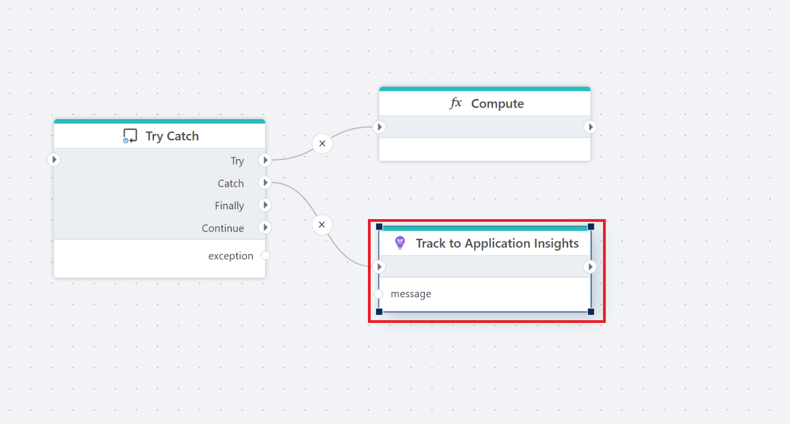

# Track

Sends diagnostics to Azure Application Insights, including a message, custom properties, severity level, and an optional exception.

**Example**   
This example shows the Track action used in a Catch path to log an exception and diagnostic message to Azure Application Insights. 

## Properties

| Name                    | Type      | Description                                                                 |
|-------------------------|-----------|-----------------------------------------------------------------------------|
| Title                   | Optional  | A descriptive label for the action.                                         |
| Connection              | Required  | Azure Application Insights [connection](connection.md) used to authenticate and connect.     |
| Message                 | Required  | The diagnostics message to log.                                             |
| Properties              | Optional  | Key-value telemetry properties to include with the message.                 |
| Include system properties | Optional | Include Flow/job/system context properties with the telemetry entry.        |
| Severity                | Optional  | Diagnostics severity,  (Verbose, Information, Warning, Error, Critical). Severity controls how the telemetry entry is categorized and filtered in Azure Application Insights.     |
| Exception               | Optional  | An exception object to attach to the telemetry entry (if available).        |
| Description             | Optional  | Additional notes or comments about the action or configuration.             |