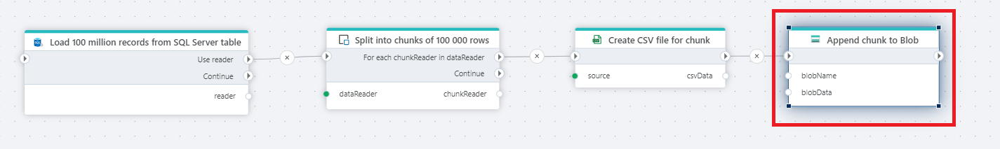

# Append to Blob

Appends a byte array to an [Azure Append Blob](https://learn.microsoft.com/en-us/rest/api/storageservices/understanding-block-blobs--append-blobs--and-page-blobs#about-append-blobs).  

The example below uses the SQL Server [Get DataReader](../sql-server/get-datareader.md), [DataReader chunker](../built-in/datareader-chunker.md), [Create CSV as byte array](../csv/create-csv-as-byte-array.md) and `Append to blob` actions to export a large number of rows from a SQL Server database to Azure blob storage by splitting them into CSV files of 100 000 records each.

## Properties

| Name             | Type      |Description                                             |
|------------------|-----------|--------------------------------------------------------|
| Connection       | Required  | A [SAS Uri](https://learn.microsoft.com/en-us/azure/storage/common/storage-sas-overview) to an Azure Blob container.       |
| Blob name        | Required  | The name of the blob to append to. If the blob does not already exist, it is created. |
| Blob data        | Required  | A byte array  |

