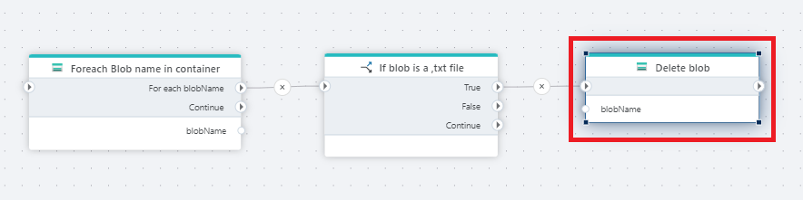

# Delete Blob

Deletes a blob from an Azure Blob container.

## Properties

| Name             | Type      |Description                                             |
|------------------|-----------|--------------------------------------------------------|
| Connection       | Required  | The [Azure Blob container connection](./azure-blob-container-connection.md). The currently supported options are `SAS URI` and `Connection string + container name`.    |
| Dynamic connection | Optional   | A connection dynamically created using the [Create Azure Blob container connection](./create-azure-blob-container-connection.md) action.    |
| Blob name        | Required  | The name of the blob to delete.                        |
