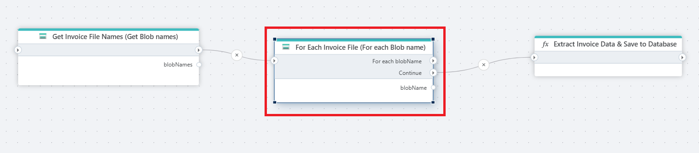

# For each Blob name

Iterates over a list of all blob names in an Azure blob container. The blob name is the name of the blob object, for example `myfile.txt`. 

## Properties

| Name             | Type      |Description                                             |
|------------------|-----------|--------------------------------------------------------|
| Connection       | Required  | The [Azure Blob container connection](./azure-blob-container-connection.md). The currently supported options are `SAS URI` and `Connection string + container name`.    |
| Dynamic connection | Optional   | A connection dynamically created using the [Create Azure Blob container connection](./create-azure-blob-container-connection.md) action.    |
| Blob name prefix | Optional  | To filter the list of blobs, specify a string for the [prefix parameter](https://learn.microsoft.com/en-us/azure/storage/blobs/storage-blobs-list#filter-results-with-a-prefix).**Note!** The prefix is case sensitive. |
| Blob name | Required | The name of the Flow variable that contains the current blob name in the list. |