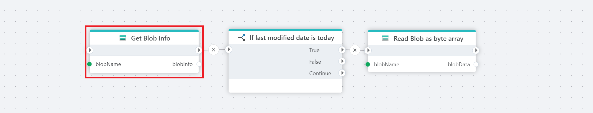

# Get Blob info

Gets detailed information for a specific blob in an Azure Blob container. Use this action if you need properties of a particular blob in a container.

**Example**   
This flow checks if a specified blob in Azure Blob Storage was modified today by first retrieving its metadata, then evaluating the last modified date, and if the date matches today's, it reads the blob content as a byte array for further processing. Used actions: [Get Blob info](), [If](../built-in/if.md) and [Read Blob as byte array](read-blob-as-byte-array.md).
 

## Properties

| Name             | Type      |Description                                             |
|------------------|-----------|--------------------------------------------------------|
| Title | Optional | The title or name of the action. |
| Connection       | Required  | The [Azure Blob container connection](./azure-blob-container-connection.md). The currently supported options are `SAS URI` and `Connection string + container name`.    |
| Dynamic connection | Optional   | A connection dynamically created using the [Create Azure Blob container connection](./create-azure-blob-container-connection.md) action. |
| Blob name | Required | The name of the blob from the list. |
| Result variable name | Required | The name of the Flow variable that contains the list of the blob properties. |
| Description | Optional | Additional notes or comments about the action or configuration.  |

 

## Returns

This action returns a **BlobInfo** object containing metadata about the specified blob.

 

[!INCLUDE ]
