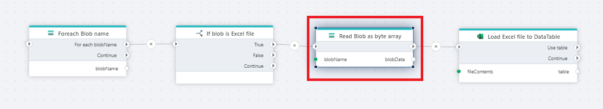

# Read Blob as byte array

Reads the contents of an [Azure Blob](https://learn.microsoft.com/en-us/azure/storage/blobs/) into memory as a byte array. You can compare this to downloading a file. For peformance reasons, prefer using [streaming](read-blob-as-stream.md) over reading as byte array if possible. Streaming is generally faster and uses less memory, because streaming doesn't require loading the entire blob into memory before you can start working with the data.

> [!NOTE]
> If you need to read the file multiple times, for example processing its contents and then sending the file somewhere else (such as to an archive), you MUST use the byte array option instead of streaming because the stream can only read once.

Once you have the blob contents, you must _load_ it using a compatible action in order to make use of the data.

For example, an Excel file can be loaded using the [Open Excel file as DataReader](../excel/open-excel-file-as-datareader.md), [Read Excel file as DataTable](../excel/read-excel-file-as-datatable.md), or [For each row in Excel file](../excel/for-each-row.md) actions. Once loaded, you can start working with the data in the Excel file.

> [!CAUTION]
> Trying to load a byte array using an incompatible action will fail.

## Returns

[Byte](https://learn.microsoft.com/en-us/dotnet/api/system.byte) [array](https://learn.microsoft.com/en-us/dotnet/csharp/language-reference/builtin-types/arrays)

## Properties

<!--prettier-ignore-->
| Name             | Type      |Description                                             |
|------------------|-----------|--------------------------------------------------------|
| Connection       | Required  | The Azure Blob Container Connection. Choose either 1. A [SAS URI](https://learn.microsoft.com/en-us/azure/storage/common/storage-sas-overview) to an Azure Blob container or 2. A Storage account connection string and container name.       |
| Blob name prefix | Optional  | To filter the list of blobs, specify a string for the [prefix parameter](https://learn.microsoft.com/en-us/azure/storage/blobs/storage-blobs-list#filter-results-with-a-prefix). **Note!** The prefix is case sensitive. |
| Result variable name | Required | The name of the Flow variable that contains the list of the blob names. |
