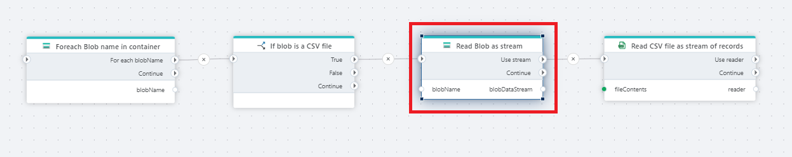

# Read Blob as stream

Reads the contents of an [Azure Blob](https://learn.microsoft.com/en-us/azure/storage/blobs/) as a [Stream](https://learn.microsoft.com/en-us/dotnet/api/system.io.stream). Prefer using streaming over [Read Blob as byte array](read-blob-as-byte-array.md) if possible. Streaming is generally faster and uses less memory, because streaming doesn't require loading the entire blob into memory before you can start working with the data.

Once you have the blob contents, you must _load_ it using a compatible action in order to make use of the data.

For example, a CSV file can be loaded using the [Open CSV file as DataReader](../csv/open-csv-file-as-datareader.md), [Read CSV file as DataTable](../csv/read-csv-file-as-datatable.md), or [Read rows from CSV file](../csv/read-rows-from-csv-file.md) actions. Once loaded, you can start working with the data in the CSV file.

> [!CAUTION]
> Trying to load a Stream using an incompatible action will fail.

## Returns

[Stream](https://learn.microsoft.com/en-us/dotnet/api/system.io.stream)

## Properties

| Name                 | Type     | Description  |
| -------------------- | -------- | -------------------------------------------- |
| Connection       | Required  | The Azure Blob Container Connection. Choose either 1. A [SAS URI](https://learn.microsoft.com/en-us/azure/storage/common/storage-sas-overview) to an Azure Blob container or 2. A Storage account connection string and container name.       |
| Blob name prefix     | Optional | To filter the list of blobs, specify a string for the [prefix parameter](https://learn.microsoft.com/en-us/azure/storage/blobs/storage-blobs-list#filter-results-with-a-prefix). **Note!** The prefix is case sensitive. |
| Result variable name | Required | The name of the Flow variable that contains the list of the blob names.                                                                                                                                                  |
