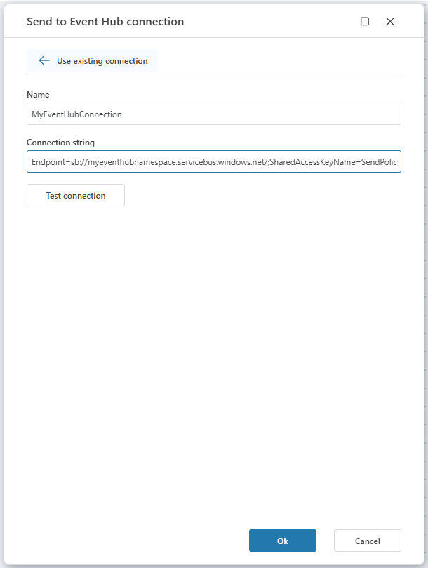

# Azure Event Hub Connection

When adding an [Azure Event Hub](https://learn.microsoft.com/en-us/azure/event-hubs/event-hubs-about) action, select an [existing connection](../../workspaces/workspace-objects.md) or create a new one.

Flow supports one connection method:
- **Connection String**

<br/>

## Connection properties

| Name | Description |
|-------|-------------|
| Name | A custom label for this connection. This name will appear when selecting the connection in a Flow action. |
| Connection string | The full connection string for the Event Hub. Includes namespace, policy name, key, and Event Hub entity path. |

<br/>

## Connection String

Use this option to connect using the Azure Event Hubs Namespace connection string.  

You can find it in the Azure Portal:

1. Go to the [Azure Portal](https://portal.azure.com).  
2. Navigate to **Event Hubs**.  
3. Select your **Event Hubs Namespace**.  
4. In the left menu, under **Settings**, click **Shared access policies**.  
5. Choose or create a policy with the required rights:<br/>  
   - **Manage** – Full control (includes Send and Listen).  
   - **Send** – Allows sending messages to the Event Hub.  
   - **Listen** – Allows receiving messages from the Event Hub.  
6. Copy the **Primary connection string** (not the key).  

<br/>

> [!IMPORTANT]  
> Always copy the **Primary connection string**, not the **Primary key**.

<br/>

> [!TIP]  
> If possible, avoid using the **RootManageSharedAccessKey**, as it grants full access to the namespace. Create a dedicated policy with minimal permissions instead.

<br/>

**Example (Send policy):**


```
Endpoint=sb://mynamespace.servicebus.windows.net/;SharedAccessKeyName=SendOnly;SharedAccessKey=abcd1234...;EntityPath=myeventhub
```


**Example (Listen policy):**

```
Endpoint=sb://mynamespace.servicebus.windows.net/;SharedAccessKeyName=ListenOnly;SharedAccessKey=xyz987...;EntityPath=myeventhub
```

<br/>




---

## Useful Links
- [Azure Event Hub Overview](https://learn.microsoft.com/en-us/azure/event-hubs/event-hubs-about)  
- [Event Hub Authentication & Security](https://learn.microsoft.com/en-us/azure/event-hubs/event-hubs-authentication-and-security-model-overview)  
