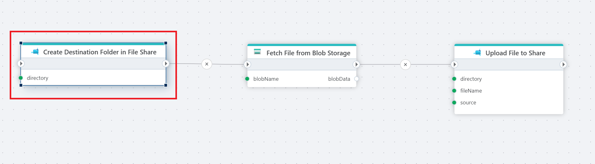

# Create directory

Creates a new directory in a [Azure Files](https://learn.microsoft.com/en-us/azure/storage/files/storage-files-introduction) share if it does not already exist.

**Example** 

The example above illustrates how to first create a folder, and then transfer files from Azure Blob Storage to an Azure Files Share. Used actions: 1. Create directory 2. [Read Blob as byte array](../azure-blob-storage/read-blob-as-byte-array.md) 3. [Upload file to a share](upload-file.md).

 

## Properties

| Name                        | Type      | Description |
|-----------------------------|-----------|--------------------------------------------------------|
| Title                       | Required  | The title of the action. |
| Connection                  | Required  | The [Azure Files connection](./connecting-to-azure-files.md) to a Share. |
| Directory                   | Required  | The path of the directory to be created (e.g., `/MyFolder`). |
| Raise exception on failure  | Optional  | Specifies whether or not to raise an error if the directory could not be created. Note that if the directory already exists, the action does nothing (an error is not raised if the directory exists). |
| Description                 | Optional  | Additional details or notes about the action. |
