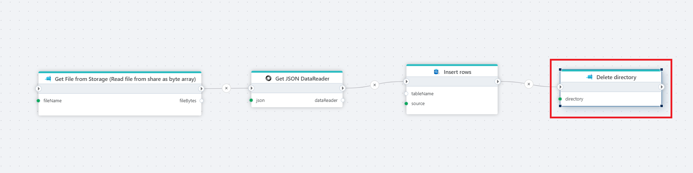

# Delete directory

Deletes a directory from an [Azure Files](https://learn.microsoft.com/en-us/azure/storage/files/storage-files-introduction) share.

**Example**   
The example above takes a file from storage, reads its JSON content, saves the data to a database, and then deletes the storage folder to keep things tidy.  Used actions: 1. [Read file from share as byte array](../azure-files/read-file-as-byte-array.md) 2. [Get JSON DataReader](../json/get-json-datareader.md) 3. [Insert rows](../sql-server/insert-data.md) 4. Delete directory.

 

## Properties

| Name                     | Type      | Description                                                 |
|--------------------------|-----------|-------------------------------------------------------------|
| Title                    | Optional  | The name of the action.                                      |
| Connection               | Required  |  The [Azure Files connection](./connecting-to-azure-files.md) to a Share.   |
| Directory                | Required  | The path to the directory to delete (e.g., /MyFolder).            |
| Delete all content       | Optional  | If checked, deletes all content within the directory.        |
| Raise exception on failure | Optional  | If checked, triggers an exception if the deletion fails.     |
| Description              | Optional  | Additional information about the action.                     |
