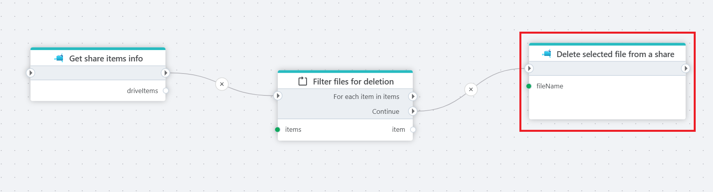

# Delete file from a share

Deletes a file from an [Azure Files](https://learn.microsoft.com/en-us/azure/storage/files/storage-files-introduction) share.

**Example**   
The example above retrieves all file informations from a share using the [Get Share Items Info](get-share-items-info.md) action. It then iterates over each item using a [For each](../built-in/foreach.md) loop. Each file is passed to the **Delete file from a share** action.  

> [!NOTE]
> The filtering logic is implemented inside the Foreach action, allowing only the relevant files to proceed to deletion.

## Properties

| Name                     | Type      | Description                                                 |
|--------------------------|-----------|-------------------------------------------------------------|
| Title                    | Optional  | The name of the action.                                      |
| Connection               | Required  |  The [Azure Files connection](./connecting-to-azure-files.md) to a Share.   |
| File name        | Required  | The name and full path to the file to delete.       |
| Description      | Optional  | Additional information about the action.                     |