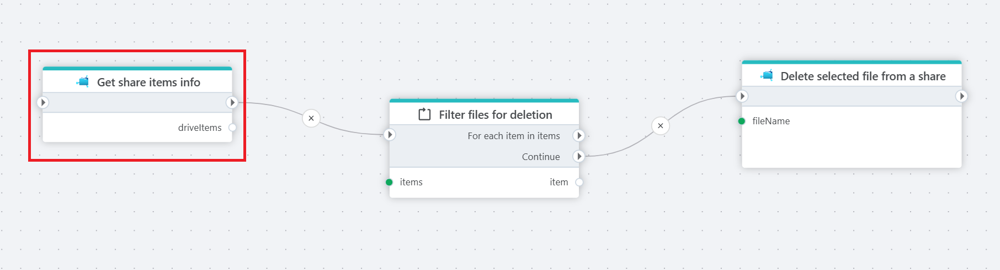

# Delete file

Deletes a file from an [Azure Files](https://learn.microsoft.com/en-us/azure/storage/files/storage-files-introduction) share.

**Example** 

Example above retrieves all files from a share ([Get Share Items Info](get-share-items-info.md)), checks conditions to filter relevant files ([Foreach](../built-in/foreach.md)), and safely removes matched file (Delete file).

## Properties

| Name                     | Type      | Description                                                 |
|--------------------------|-----------|-------------------------------------------------------------|
| Title                    | Optional  | The name of the action.                                      |
| Connection               | Required  |  The [Azure Files connection](./connecting-to-azure-files.md) to a Share.   |
| File name        | Required  | The name and full path to the file to delete.       |
| Description      | Optional  | Additional information about the action.                     |