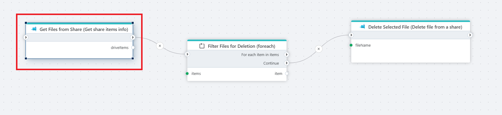

# Get Share Items Info

Retrieves a list of information about files or directories from an [Azure Files](https://learn.microsoft.com/en-us/azure/storage/files/storage-files-introduction) share.

**Example**   
The example above retrieves all file informations from a share using the **Get Share Items Info** action. It then iterates over each item using a [For each](../built-in/foreach.md) loop. Each file is passed to the [Delete file from a share](delete-file.md) action.  

> [!NOTE]
> The filtering logic is implemented inside the Foreach action, allowing only the relevant files to proceed to deletion.

## Properties

| Name                           | Type      | Description |
|--------------------------------|-----------|-------------|
| Connection                     | Required  | The [Azure Files connection](./connecting-to-azure-files.md) to a share. |
| Directory                      | Optional  | The directory to retrieve information from. |
| Prefix                         | Optional  | An optional file name prefix to filter files. |
| Include directories            | Boolean   | Whether to include directories along with files. |
| Include files in subdirectories | Boolean   | Whether to traverse and include items in subfolders. |
| Result variable name           | Required  | The name of the variable containing the collected information. |
