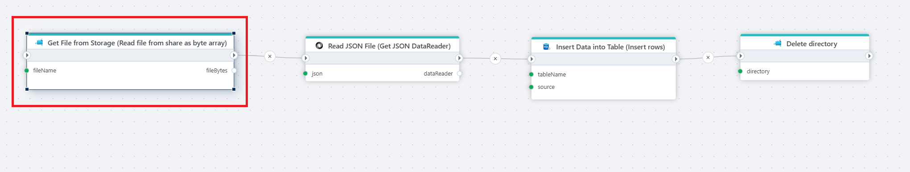

# Read file from share as byte array

Reads the contents of a file in an [Azure Files](https://learn.microsoft.com/en-us/azure/storage/files/storage-files-introduction) share as a byte array.

**Example** 

The example above demonstrates a file processing and cleanup operation. This flow retrieves a file from shared storage, converts its content to a JSON string, and then cleans up by deleting the associated directory.  Used actions: 1. Read file from share as byte array 2. [Read JSON file as string](../json/read-json.md) 3. [Delete directory](delete-directory.md).

 

## Properties

| Name       | Type     | Description                                                              |
| ---------- | -------- | ------------------------------------------------------------------------ |
| Connection | Required | The [Azure Files connection](./connecting-to-azure-files.md) to a Share. |
| File name  | Required | The name and full path to the file to download.                          |

## Returns

[Byte](https://learn.microsoft.com/en-us/dotnet/api/system.byte) [array](https://learn.microsoft.com/en-us/dotnet/csharp/language-reference/builtin-types/arrays)
