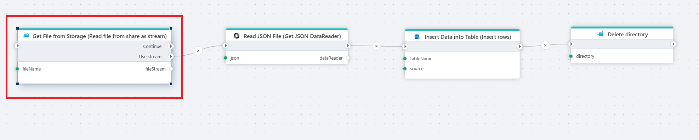

# Read file from share as stream

Reads the contents of a file in an [Azure Files](https://learn.microsoft.com/en-us/azure/storage/files/storage-files-introduction) share as a stream.

**Example** 

The example above takes a file from storage, reads its JSON content, saves the data to a database, and then deletes the storage folder to keep things tidy.  Used actions: 1. Read file from share as a stream 2. [Get JSON DataReader](../json/get-json-datareader.md) 3. [Insert rows](../sql-server/insert-data.md) 4. [Delete directory](delete-directory.md).

 

## Returns

[Stream](https://learn.microsoft.com/en-us/dotnet/api/system.io.stream)

## Properties

| Name             | Type      |Description                                             |
|------------------|-----------|--------------------------------------------------------|
| Connection       | Required  | The [Azure Files connection](./connecting-to-azure-files.md) to a Share. |
| File name        | Required  | The name and full path to the file to download. |