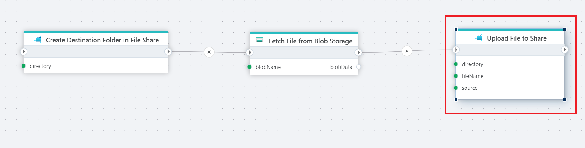

# Upload file to a share

Upload a file to an [Azure Files](https://learn.microsoft.com/en-us/azure/storage/files/storage-files-introduction) share.

**Example**

In this example a company wants to transfer reports from their Azure Blob Storage to Azure File Share. Used actions: 1. [Create directory](create-directory.md) 2. [Read Blob as byte array](../azure-blob-storage/read-blob-as-byte-array.md) 3. Upload file to a share.

## Properties

| Name             | Type      |Description                                             |
|------------------|-----------|--------------------------------------------------------|
| Connection       | Required  | The [Azure Files connection](./connecting-to-azure-files.md) to a Share. |
| Target Directory | Optional  | Directory to store the file in. |
| File name        | Required  | The name file to upload. |
| File Data        | Required  | The source for the file content. It must be a byte array or [Stream](https://learn.microsoft.com/en-us/dotnet/api/system.io.stream). |
| Overwrite        |           | If not checked, the action will fail if a file with the same name already exists. |
| Result variable name | Optional | Add a name if You want to get an result object with information on e.g. the new file id for the uploaded file. | 