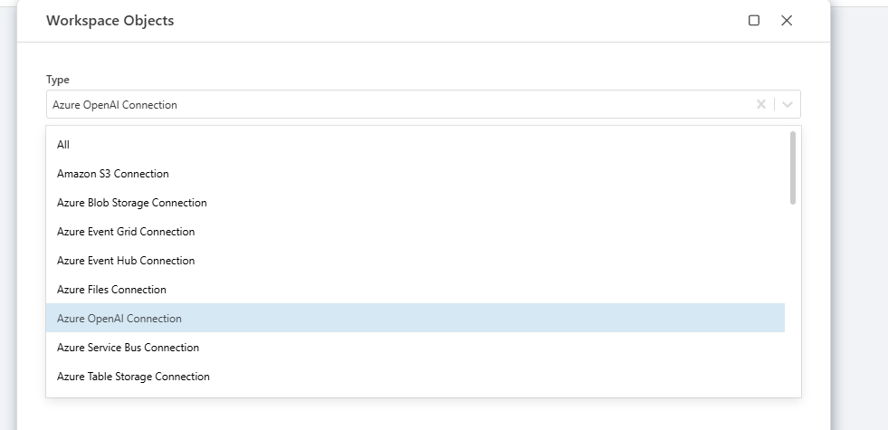
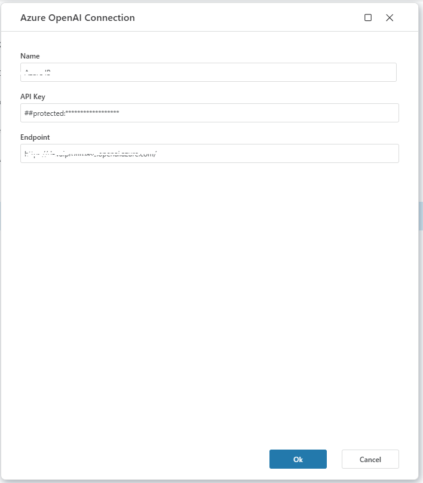
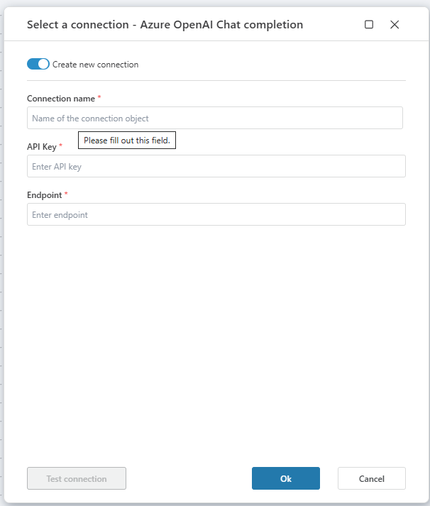

# Connecting to Azure OpenAI

**Azure OpenAI** connection allows users to interact with Azure OpenAI services by providing necessary authentication details.

## Connection Details

An Azure OpenAI connection consists of the following fields:

| Field            | Description                                                  |
|----------------|----------|--------------------------------------------------------------|
| **Name**           | Name of the connection.                                      |
| **API Key**        | The API key used for authentication.                        |
| **Endpoint**       | The endpoint URL for the Azure OpenAI instance.             |

## Creating a New Connection

To add an Azure OpenAI action, select an **existing connection** or create a new one. Follow these steps:

1. Select **Connection** in the property panel.
2. Click on **Create New Connection** or select an existing one.
3. For new connection, fill in the required fields:
   - **Name**: Enter a unique identifier for this connection.
   - **API Key**: Provide the API key associated with your Azure OpenAI instance.
   - **Endpoint**: Input the full URL of your OpenAI deployment (e.g., `https://your-instance.openai.azure.com/`).
4. Click **Test Connection** to verify the setup.
5. If successful, save the connection.

