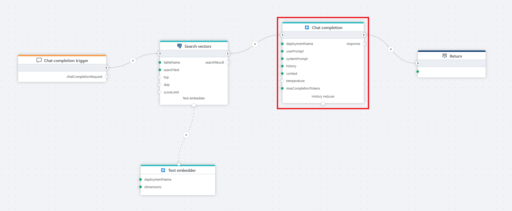

# Chat Completion

The **Chat Completion** returns the response from an [Azure OpenAI](https://learn.microsoft.com/en-us/azure/ai-services/openai/) chat model based on user input. 

**Example**   
This flow processes a user's chat question by first receiving it through a [Chat completion](../../triggers/ai/chat-completion-trigger.md) trigger, then converting it into a vector using a [text embedder](../azure-openai/text-embedder.md), performing a [Vector search](../postgresql/vector-search.md) in a postgreSQL database for relevant context, and finally passing the user input and retrieved context to Azure OpenAI **Chat completion**, which generates a response that is returned to the client via the [Return](../built-in/return.md) node.

 

## Properties

| Name                  | Type      | Description |
|-----------------------|-----------|-------------|
| Title             | Optional  | The title of the action. |
| Connection        | Required  | Defines the [connection](azure-openai-connection.md) to **Azure OpenAI**. |
| Deployment Name   | Required  | Specifies the model deployment name, which corresponds to the custom name chosen during model deployment in the Azure portal or in [Azure AI Foundry](https://ai.azure.com) ([see below](#deployment-name)). In the Azure Portal, the deployment name can be found under **Resource Management** > **Model Deployments**. |
| User Prompt       | Required  | The input message from the user, which the model processes to generate a response. |
| System Prompt     | Optional  | A system-level instruction that guides the model’s behavior and response style. |
| History           | Optional  | A record of past interactions that provides context to the conversation, helping the model maintain continuity. |
| Context           | Optional  | Typically used for RAG, and provides additional information or domain-specific knowledge to the chat model so it can make more accurate responses. The input can be a string (text) or a vector search result, such as the result from the PostgreSQL [Vector Search](../postgresql/vector-search.md) action. |
| Temperature       | Optional  |Temperature in models controls the randomness and creativity of the generated responses. Lower temperatures (e.g., 0.2) produce more focused, predictable text, ideal for tasks that require precision. Higher temperatures (e.g., 1.5) increase creativity and variability, but may risk generating less coherent or relevant content, making it important to adjust based on your desired outcome.  The default is 0.7 if nothing is defined by the user.|
| Max Completion Tokens | Optional | Sets a limit on the number of tokens (words, characters, or pieces of text) in the model’s response. |
| Result Variable Name | Optional | Stores the generated AI response. Default: "response". |
| Description       | Optional  | Additional details or notes regarding the chat completion setup. |

 

#### Deployment name
To find the Deployment name, look in the `Deployments` screen in [Azure AI Foundry](https://ai.azure.com).  

