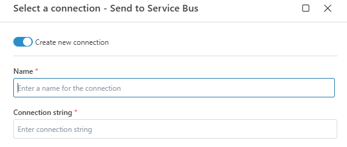

# Azure Service Bus Connection

When adding an [Azure Service Bus](https://learn.microsoft.com/en-us/azure/service-bus-messaging/service-bus-messaging-overview) action (e.g., *Send to Service Bus*), select an [existing connection](../../workspaces/workspace-objects.md) or create a new one.

Flow uses a **connection string** to securely connect to your Azure Service Bus namespace.

<br/>

## Connection details

An Azure Service Bus connection includes the following fields:

| Field | Description |
|-------|-------------|
| **Name** | A custom label for the connection. This name will appear when selecting the connection in a Flow action. |
| **Connection String** | A full connection string that grants access to your Azure Service Bus namespace and the messaging entities within. |

> **TIP**  
> Use a **shared access policy** with scoped permissions (e.g., send-only or listen-only) instead of the root policy for improved security.

<br/>

## Get the Connection String

To retrieve the connection string:

1. Open the [Azure Portal](https://portal.azure.com).
2. Navigate to **Service Bus** and select your **namespace**.
3. In the left-hand menu, under **Settings**, click **Shared access policies**.
4. Select a policy (e.g., `RootManageSharedAccessKey` or create a custom one).
5. Copy the **Primary connection string**.

> **NOTE**  
> The selected policy must include the appropriate rights for your use case:
> - **Send** – to post messages to a queue or topic.
> - **Listen** – to receive messages from a queue or subscription.
> - **Manage** – full control (not recommended for most production scenarios).

<br/>

**Example**

```
Endpoint=sb://myservicebusnamespace.servicebus.windows.net/;SharedAccessKeyName=SendOnly;SharedAccessKey=abc123def456...
```

<br/>



<br/>

## Best Practices

- **Use a least-privilege shared access policy.**
- **Rotate keys regularly** to maintain security.
- **Document which actions use which connections**, especially if using multiple policies.
