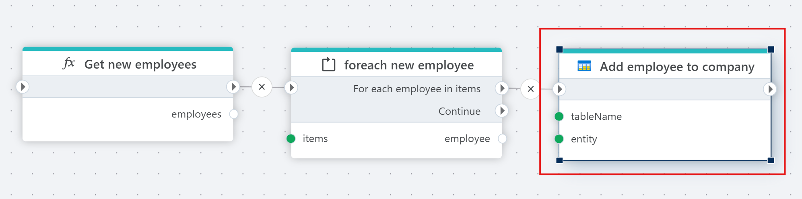

# Add Table Entity

Add an entity to an Azure Table.

## Returns

Returns a list of the table entities.

## Properties

| Name                   | Type       | Description          |
|------------------------|------------|-------------------|
| Title              | Optional   | A user-defined title for the action.            |
| Connection         | Required   | Specify the connection to the Azure Table Storage account.            |
| Table name         | Required   | The name of the table to insert into.                    |
| Entity             | Required   | The entity data to be inserted into the table.            |
| PartitionKey type  | Optional   | Specify how the `PartitionKey` is determined (e.g., use an entity property).            |
| PartitionKey property | Optional | Define the property name used for the `PartitionKey` (if applicable).                    |
| RowKey property    | Optional   | Define the property name used for the `RowKey` (if applicable).   |
| Overwrite existing | Optional   | A boolean option to specify whether to overwrite an existing entity with the same keys (`true`/`false`). |

[!INCLUDE [connection](connection.md)]
