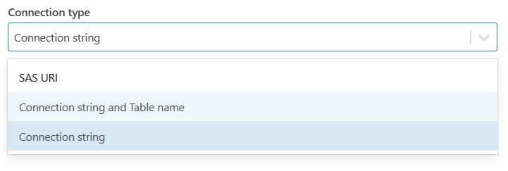
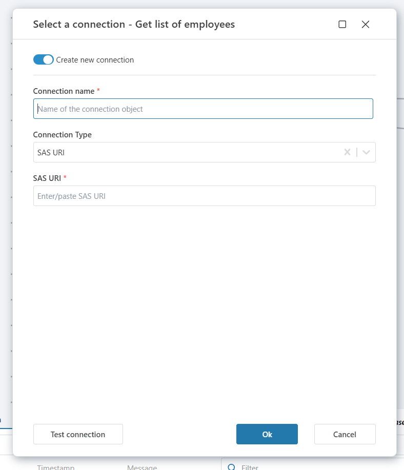
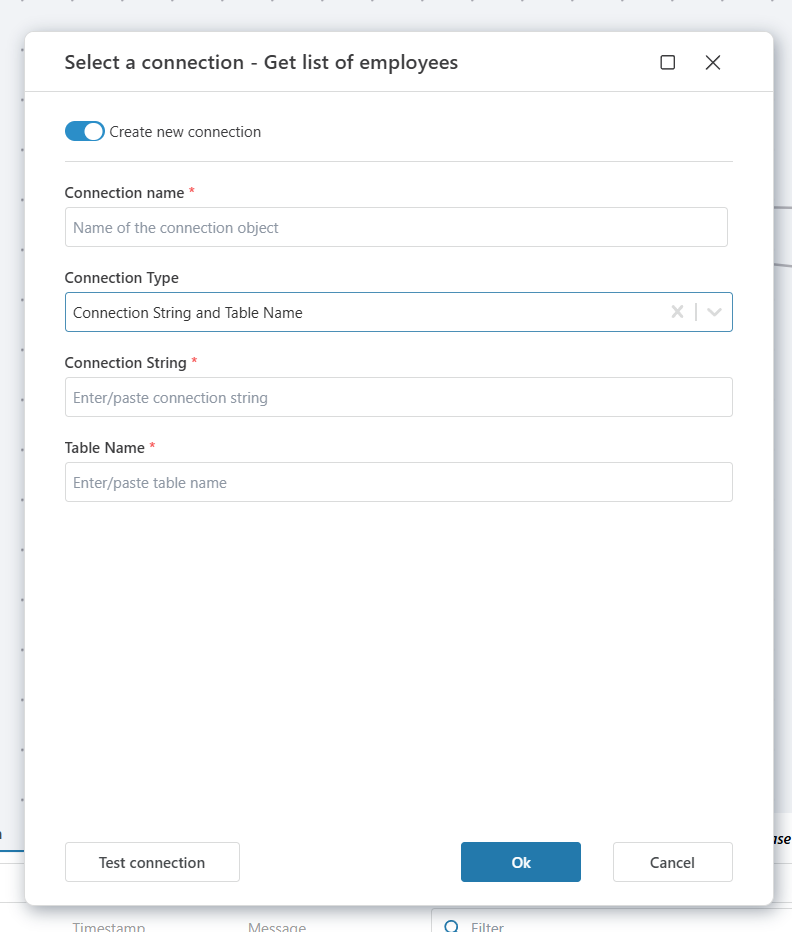

# Azure Table Storage Connection

When adding an [Azure Table Storage](https://learn.microsoft.com/en-us/azure/storage/tables/table-storage-overview) action, select an [existing connection](../../workspaces/workspace-objects.md) or create a new one.

Flow supports multiple connection methods:
- **SAS URI to a storage account** with access to all tables
- **SAS URI to a specific Azure Table**
- **Connection string to the storage account**
- **Connection string + Table name**




<br/>

## Connection details

An Azure Table Storage connection includes the following fields:

| Field | Description |
|-------|-------------|
| Connection Name | A custom label for the connection. This name will appear when selecting a connection in a Flow action. |
| Connection Type | Choose how to connect to Azure Table Storage. Options:<br/><br/>• **SAS URI (Account or Table)**<br/>• **Connection String**<br/>• **Connection String + Table Name** |

<br/>

## SAS URI

This method uses a **Shared Access Signature (SAS) URI** to grant access to your Azure Table or account. It is the most secure and scoped method.

| Field | Description |
|-------|-------------|
| **SAS URI** | A URI that includes the SAS token, permissions, and expiration. This can either target the entire storage account or a specific table. |

> **Note**  
> If your SAS URI points to the storage account, it must include permission to access table services (`ss=t`). Ensure it also includes **Table-level permissions**, such as `sp=raud` (Read, Add, Update, Delete).

### Generate a SAS URI

1. Open the [Azure Portal](https://portal.azure.com).
2. Go to **Storage accounts** and select your account.
3. In the left menu, select **Shared access signature** under *Settings*.
4. Check the box for **Table** under *Allowed services*.
5. Choose desired permissions (Read, Add, Update, Delete).
6. Set **start** and **expiry time**.
7. Click **Generate SAS and connection string**.
8. Copy the **Table service SAS URL**.

<br/>

**Example (SAS URI to account):**  
```
https://mystorageaccount.table.core.windows.net/?sv=2022-11-02&ss=t&srt=sco&sp=raud&se=2025-08-01T00:00:00Z&st=2025-07-21T00:00:00Z&spr=https&sig=xyz...
```

**Example (SAS URI to table):**  
```
https://mystorageaccount.table.core.windows.net/mytable?sv=2022-11-02&ss=t&srt=sco&sp=raud&se=2025-08-01T00:00:00Z&st=2025-07-21T00:00:00Z&spr=https&sig=xyz...
```

<br/>



<br/>

## Connection String (with or without table name)

This method uses a full connection string for the Azure Storage account. You can optionally include the table name.

| Field | Description |
|-------|-------------|
| **Connection String** | The full connection string from Azure Storage. Grants access to all tables under that account. |
| **Table Name** (optional) | Specify if you want the connection to always target a specific table. |

### Get the Connection String

1. In the [Azure Portal](https://portal.azure.com), navigate to **Storage accounts**.
2. Choose your account.
3. In the left-hand menu, select **Access keys** under *Security + networking*.
4. Copy either **Connection string (key1 or key2)**.

**Example:**
```
DefaultEndpointsProtocol=https;AccountName=mystorageaccount;AccountKey=abcd1234...;EndpointSuffix=core.windows.net
```

<br/>



> **Tip**  
> For improved security, you can use a **connection string with a SAS token** instead of an account key.

<br/>

## Summary of Supported Connection Types

| Type | Description |
|------|-------------|
| **SAS URI (Account)** | Full URI to storage account, with table permissions |
| **SAS URI (Table)** | URI scoped to a specific Azure Table |
| **Connection String** | Access to entire account (all tables) |
| **Connection String + Table Name** | Limits actions to the specified table |
