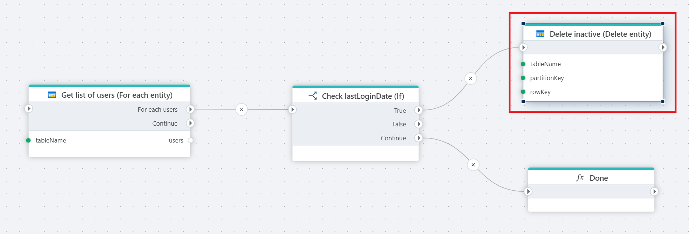

# Delete Table Entity

Delete an entity from an Azure Table.

**Example**   
This flow [iterates](foreach-table-entity.md) through each employee in an Azure Table, checks if they’ve been inactive for over 12 months based on `lastLoginDate`, and deletes them. It processes each employee one by one, then ends with a 'Done' step once all are evaluated.

 

## Properties

| Name                   | Type       | Description                |
|------------------------|------------|---------------------------------|
| Title              | Optional   | A user-defined title for the action.                 |
| Connection         | Required   | Specify the [connection](connecting-to-azure-table-storage.md) to the Azure Table Storage account.        |
| Table name         | Required   | The name of the table to insert into.                  |
| PartitionKey  | Required   | Select or enter the value of `PartitionKey`.  |
| RowKey    | Required   | Value of the `RowKey`.                                     |

