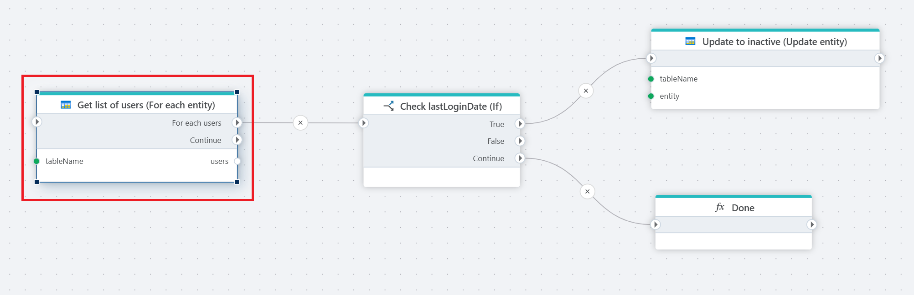

# For each Entity

Iterates over a list of all entities in an Azure table. 

**Example**   
This flow iterates through each employee in an Azure Table, checks if they’ve been inactive for over 30 days based on `lastLoginDate`, and [updates](update-table-entity.md) their status to "inactive" if needed. It processes each employee one by one, then ends with a 'Done' step once all are evaluated.

 

## Returns

Returns a list of the table entities.

## Properties

| Name                   | Type      | Description                                                                                          |
|------------------------|-----------|-----------------------------------------------------|
| Title                  | Optional  | A user-defined title for the action.     |
| Connection             | Required  | Specify the [connection](connecting-to-azure-table-storage.md) to the Azure Table Storage account. |
| Table name            | Required  | The name of the table containing data.   |
| Entity properties | Optional | Define the properties of the table entities to use in the iteration.   |
| Filter   | Optional  | Configure filters to refine the list of table entities to process.   |
| Entity name            | Optional  | The name of the table entity to iterate over.      |

### Filter

**Simple** filtering, accepts input or variable input:

**Advanced** filtering accepts input or variable input:

