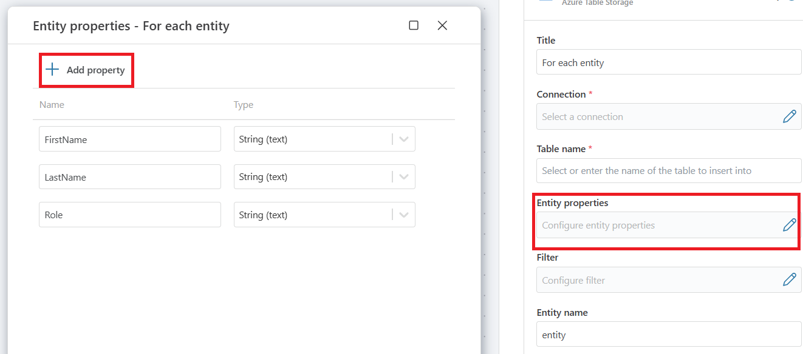

# Foreach Table Entity

Iterates over a list of all entities in an Azure table. 

## Properties

| Name                   | Type      | Description                                                                                          |
|------------------------|-----------|-----------------------------------------------------|
| Title                  | Optional  | A user-defined title for the action.     |
| Connection             | Required  | Specify the connection to the Azure Table Storage account. Choose either 1. A [SAS URI](https://learn.microsoft.com/en-us/azure/storage/common/storage-sas-overview) to an Azure Blob container or 2. A Storage account connection. |
| Entity name            | Required  | The name of the table entity to iterate over.      |
| Table Entity properties | Optional | Define the properties of the table entities to use in the iteration.   |
| Table Entity filters   | Optional  | Configure filters to refine the list of table entities to process.   |

### Connection

A [SAS URI](https://learn.microsoft.com/en-us/azure/storage/common/storage-sas-overview) connection:

A Storage account connection:

### Table Entity Properties 

### Table Entity Filters

**Simple** filtering, accepts input or variable input:

**Advanced** filtering accepts input or variable input:

