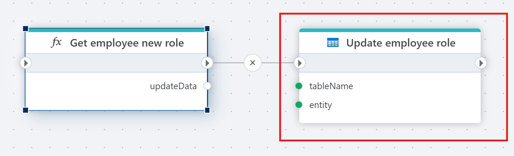
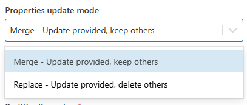
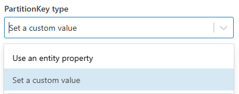

# Update Table Entity

Update an entity in an Azure Table.

## Properties  

| Name                        | Data Type       | Description              |
|-----------------------------|-----------------|---------------|
| Title                       | Optional        | The title or name of the command.   |
| Connection                  | Required        | The Azure Table Storage connection.      |
| Table name                  | Required        | The name of the table where the entity is stored.         |
| Entity                      | Required        | The entity to update.                     |
| Properties update mode      | Optional        | Specifies how properties are updated (e.g., Merge - Update provided, keep others).           |
| PartitionKey type           | Optional        | The type of PartitionKey (e.g., use an entity property or a specific value).                 |
| PartitionKey property       | Optional        | The property for the PartitionKey.       |
| RowKey property             | Optional        | The property for the RowKey.             |

### Properties update mode  

1. **Merge** - Update provided, keep others

Updates only the provided properties of the entity while retaining any properties that are not included in the update.
This option is selected in the screenshot.

2. **Replace** - Update provided, delete others

Replaces the entity's properties entirely with the provided properties, removing any properties not included in the update.

### PartitionKey type 

1. **Use an entity property** – This option allows the PartitionKey to be based on a property from the entity.
2. **Set a custom value** – This option lets you define a custom value for the PartitionKey.