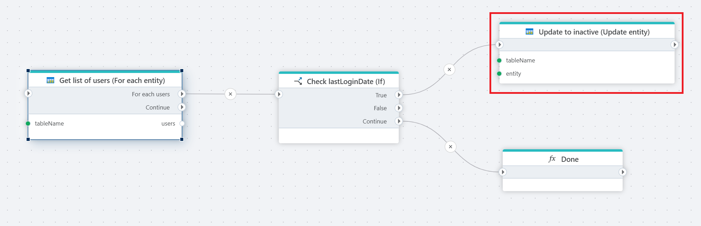

# Update Entity

Update an entity in an Azure Table.

**Example**   
This flow [iterates](foreach-table-entity.md) through each employee in an Azure Table, checks if they’ve been inactive for over 30 days based on `lastLoginDate`, and updates their status to "inactive" if needed. It processes each employee one by one, then ends with a 'Done' step once all are evaluated.

 

## Properties  

| Name                        | Data Type       | Description              |
|-----------------------------|-----------------|---------------|
| Title                       | Optional        | The title or name of the command.   |
| Connection                  | Required        | The Azure Table Storage connection.      |
| Table name                  | Required        | The name of the table where the entity is stored.         |
| Entity                      | Required        | The entity to update.                     |
| Properties update mode      | Optional        | Specifies how properties are updated (e.g., Merge - Update provided, keep others).           |
| PartitionKey type  | Optional   | Specify how the `PartitionKey` is determined (e.g., use an entity property).            |
| PartitionKey property | Optional | Define the property name used for the `PartitionKey` (if applicable).                    |
| PartitionKey value | Optional | Define the value of the `PartitionKey` (if applicable).        |
| RowKey property    | Optional   | Define the property name used for the `RowKey` (if applicable).   |
| Overwrite existing | Optional   | A boolean option to specify whether to overwrite an existing entity with the same keys (`true`/`false`). |

### Properties update mode  

1. **Merge** - Update provided, keep others

Updates only the provided properties of the entity while retaining any properties that are not included in the update.
This option is selected in the screenshot.

2. **Replace** - Update provided, delete others

Replaces the entity's properties entirely with the provided properties, removing any properties not included in the update.

### PartitionKey type 

1. **Use an entity property** – This option allows the PartitionKey to be based on a property from the entity. “PartitionKey property” will be applicable if the “PartitionKey type” is set to “Use a custom entity property”.

2. **Set a custom value** – This option lets you define a custom value for the PartitionKey. “PartitionKey value” will be applicable if the “PartitionKey type” is set to “Use a custom value”. 

