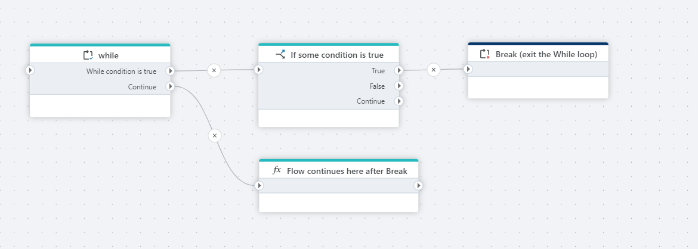

# Break

Terminates (exits) the closest enclosing [Foreach](foreach.md) or [While](while.md) loop.

**Example**   
This flow continuously checks if the system is in maintenance mode, and immediately exits the loop using a Break node when maintenance is detected, allowing the process to continue with alternate actions outside the loop.
 

## Properties

| Name                      | Type | Description                                                                       |
| ------------------------- | --------- | --------------------------------------------------------------------------------- |
| Title                     | Optional  | The title or name of the action.                                                 |
| Description               | Optional  | Additional notes or comments about the action or configuration.                   |