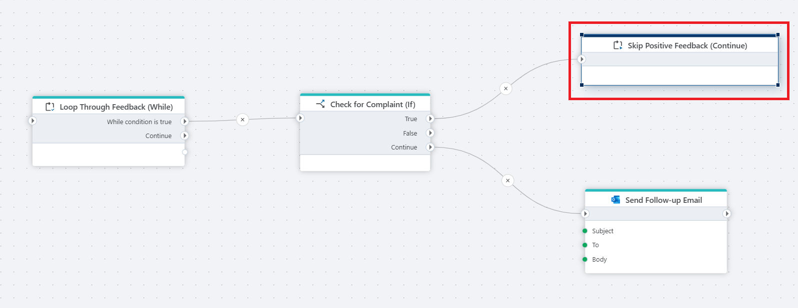

# Continue

Starts a new iteration of the closest enclosing [Foreach](foreach.md) or [While](while.md) loop.

## Properties

| Name                      | Type | Description                                                                       |
| ------------------------- | --------- | --------------------------------------------------------------------------------- |
| Title                     | Optional  | The title or name of the action.                                                 |
| Description               | Optional  | Additional notes or comments about the action or configuration.                   |