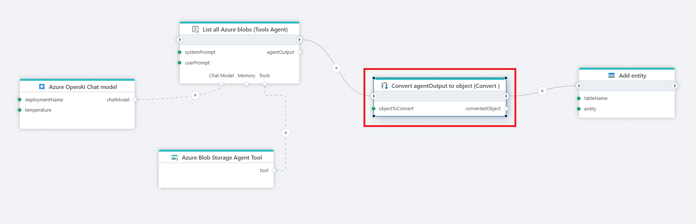

# Convert

Converts between objects of different data types, for example string to number or date.
You should also use this action if you need to convert JSON, streams, byte arrays, collections or business objects / custom types.

The Convert action supports the following conversions:

| From type               | To type                                 |
|-------------------------|-----------------------------------------|
| Any [built-in .NET Type](https://learn.microsoft.com/en-us/dotnet/csharp/language-reference/builtin-types/built-in-types)  | Any [built-in .NET type](https://learn.microsoft.com/en-us/dotnet/csharp/language-reference/builtin-types/built-in-types)                  |
| Custom type             | JSON                                    |
| Anonymous type          | Custom type                             |
| String                  | byte array (`byte[]`)                              |
| [Stream](https://learn.microsoft.com/en-us/dotnet/api/system.io.stream)                  | byte array (`byte[]`)                             |
| Object                  | JSON string encoded as UTF8 byte array  |
| String                  | [DataTable](https://learn.microsoft.com/en-us/dotnet/api/system.data.datatable)                               |
| [IEnumerable<T>](https://learn.microsoft.com/en-us/dotnet/api/system.collections.generic.ienumerable-1)          | [DataTable](https://learn.microsoft.com/en-us/dotnet/api/system.data.datatable)                               |
| String                  | Custom type                             |
| UTF8 JSON Stream        | Custom type                             |
| UTF8 JSON Stream        | .NET [built-in type](https://learn.microsoft.com/en-us/dotnet/csharp/language-reference/builtin-types/built-in-types)  |
| UTF8 JSON string        | Custom type                             |
| UTF8 JSON string        | .NET [built-in type](https://learn.microsoft.com/en-us/dotnet/csharp/language-reference/builtin-types/built-in-types) |
| [DataTable](https://learn.microsoft.com/en-us/dotnet/api/system.data.datatable)               | [Supported collection types for deserialization](https://learn.microsoft.com/en-us/dotnet/standard/serialization/system-text-json/supported-collection-types)                          |

