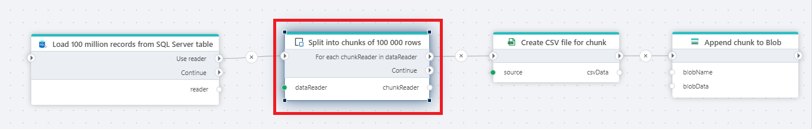

# DataReader chunker

Splits the records in a DataReader into multiple chunks.

Use this action when reading a large number of rows that needs to be split into chunks or batches for processing.  
For example, if you need to export millions of rows from a database to a CSV file in Azure Blob Storage, you might not be able to do this in a single operation due to limitation of available memory. In this case, you can use the chunker to split rows into batches of manageable sizes and use the [Append to Blob](../azure-blob-storage/append-to-blob.md) action to upload one chunk at a time.

  

**Example**   
This flow example shows a process that reads data from a database, splits records into multiple chunks, converts each chunk into CSV format, and appends it to a blob storage.  
Actions used in the flow are: SQL Server [Get DataReader](../sql-server/get-datareader.md), [DataReader chunker](), [Create CSV file as byte array](../csv/create-csv-file-as-byte-array.md) and [Append to Blob](../azure-blob-storage/append-to-blob.md). 

 

## Properties

| Name                | Type     | Description                                                                                                                  |
| ------------------- | -------- | ---------------------------------------------------------------------------------------------------------------------------- |
| DataReader          | Required | The [IDataReader](https://learn.microsoft.com/en-us/dotnet/api/system.data.idatareader) to split into chunks (or "batches"). |
| Chunk variable name | Required | The name of the chunker.                                                                                                     |
| Chunk size          | Required | The number of records in each chunk.                                                                                         |

 

## Returns

[IEnumerable](https://learn.microsoft.com/en-us/dotnet/api/system.collections.generic.ienumerable-1)<[IDataReader]((https://learn.microsoft.com/en-us/dotnet/api/system.data.idatareader))>
